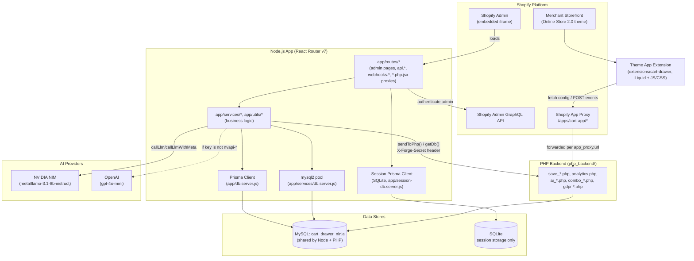
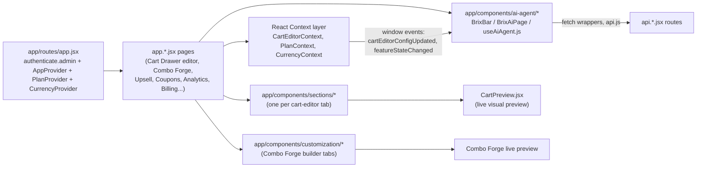
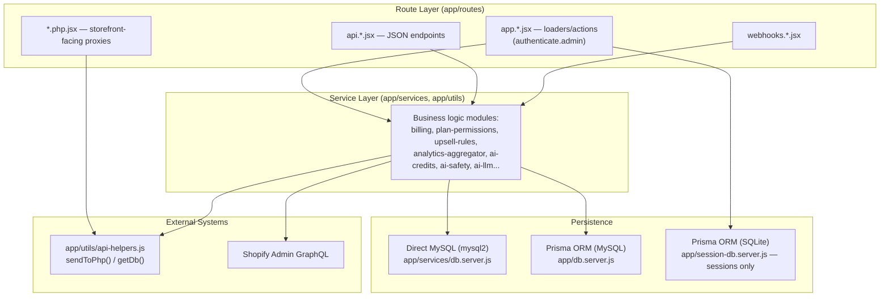
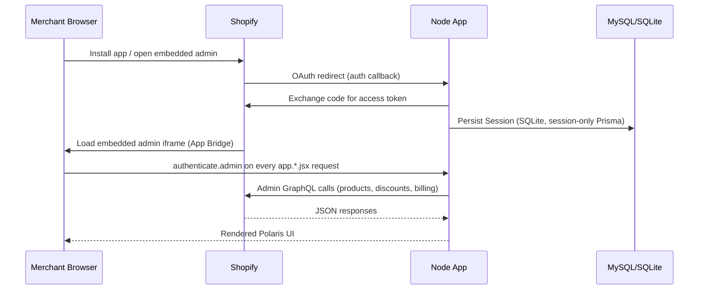
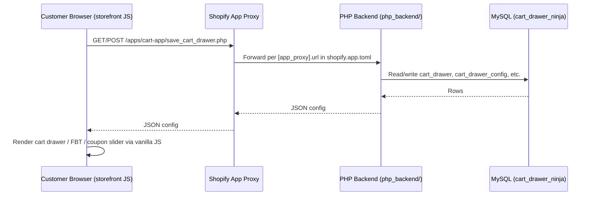
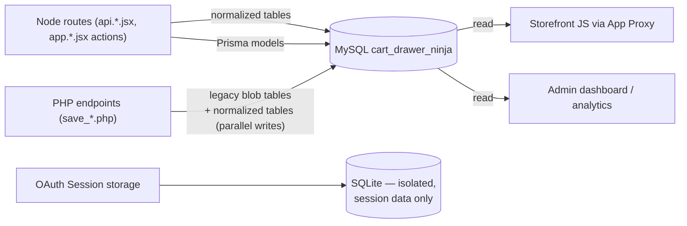
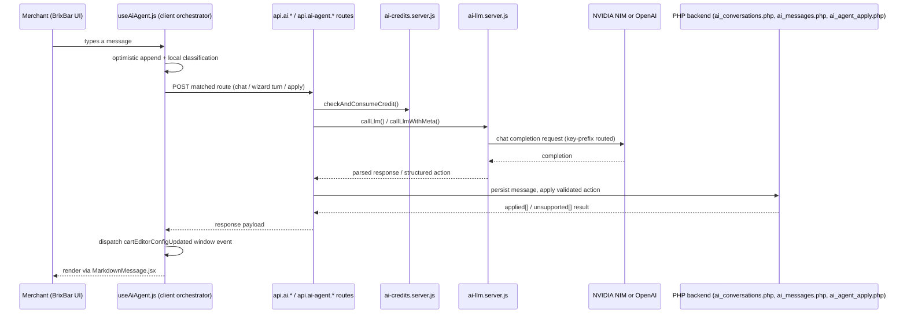
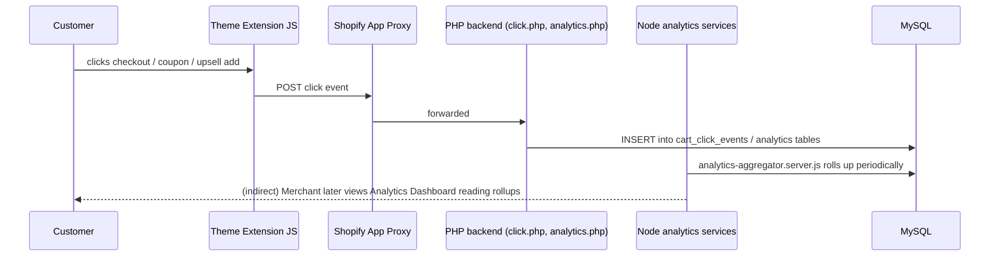

# Part 1 — Cover, Executive Summary, Architecture, Folder Structure, Tech Stack

> Part of the **Brix (The Cart Ninja) Application Knowledge Base**. See [00-INDEX.md](./00-INDEX.md) for the full table of contents and how this document set was generated.

---

## 1. Cover Page

| | |
|---|---|
| **Application Name** | Brix (storefront/marketing brand: **The Cart Ninja**) |
| **Shopify App Name (shopify.app.toml)** | `Brix` |
| **Client ID** | `9f7189f9faf11f0771c1ef2f81c42b8d` *(public app identifier — not a secret)* |
| **Repository root** | `c:\xampp\htdocs\cartdrawerv2_ui` |
| **Version** | Not Verified from Source Code — no `version` field is present in `package.json`; treat this document as describing the state of the `master` branch as of the generation date below. |
| **Author (package.json)** | `abilashmi` |
| **Generated Date** | 2026-07-16 |
| **Architecture Version / Snapshot Basis** | Cross-referenced against `CLAUDE.md` (2026-06-28) and `APP_STRUCTURE.md` (2026-07-14), verified against live source at generation time. |

**Naming note (important, do not confuse these):** The codebase, database, and most legacy documents call the product **"Cart Ninja"** (database name `cart_drawer_ninja`, PHP backend historically at `int.thecartninja.com`). The current Shopify app configuration (`shopify.app.toml`) registers it under the name **"Brix"**, the AI assistant is branded **BrixBar/Brix AI**, and the live PHP backend domain is now `https://int.thecomboforge.com` (a further rebrand — "Combo Forge" is the bundle-builder module name). Older documents in this repo (`BRD.md`, `APP_SPECIFICATION.md`, `USER_GUIDE.md`) predate this rebrand and refer to "CartNinja" as the AI assistant's name and to `int.thecartninja.com` as the backend — these are historical names for what is now Brix / BrixBar / `int.thecomboforge.com`. This knowledge base uses **current code-verified names** and calls out legacy terminology explicitly where it appears.

---

## 2. Executive Summary

### What the app does

Brix (Cart Ninja) is a **Shopify embedded application** that replaces a store's default cart page with a customizable slide-out **cart drawer**, and layers revenue-focused merchandising tools on top of it:

- A **rewards progress bar** that nudges shoppers toward a spending milestone (e.g., free shipping).
- A **coupon slider** that surfaces active Shopify discount codes inside the open cart for one-click apply.
- A **Frequently Bought Together (FBT)** widget that recommends complementary products.
- A standalone **upsell rules engine** (global / trigger-based / cart-value-based rules).
- **Combo Forge**, a bundle-page builder that publishes dedicated multi-product bundle pages to the merchant's storefront with no code.
- An in-app **AI assistant ("Brix"/BrixBar)** embedded across the admin UI that can answer configuration questions, write on-brand copy, and — through a small set of guarded, confirm-before-execute flows — directly create upsell rules, discounts, progress-bar tiers, and combo templates on the merchant's behalf.
- A merchant-facing **analytics dashboard** tying every click and coupon redemption back to attributed revenue.

### Main purpose / business goals

Per `BRD.md` (Business Requirements Document, v1.0), the app's objectives are:

1. Increase Average Order Value (AOV) for Shopify merchants.
2. Improve cart-to-checkout conversion rate.
3. Provide merchants a no-code solution to deploy cart enhancements.
4. Enable data-driven decisions through actionable cart analytics.
5. Maximize coupon redemption and upsell click-through rates.

The pitch (per `BRIX_OVERVIEW.md`) is that most stores would otherwise need 4–5 separate apps (a cart app, an upsell app, a coupon app, a bundle app) — Brix consolidates these into one subscription, one dashboard, and one Theme App Extension install. All merchandising surfaces fire **inside the open cart drawer**, framed as "the highest-intent moment in the shopping journey."

### Problems it solves

- Native Shopify carts are a static, low-engagement page; Brix turns the cart into an active merchandising surface without requiring theme code edits (installed purely via Shopify Theme App Extension blocks).
- Merchants without developer resources can configure rewards gamification, upsells, and bundles through a Polaris-based no-code dashboard with live preview.
- Coupon discovery friction (customers leaving the cart to hunt for a code) is reduced by surfacing valid codes directly in the drawer.
- Bundle/kit selling normally requires custom development; Combo Forge generates a live Shopify page for a bundle in minutes.
- Merchants lack cart-level visibility into what's driving or losing revenue; the Analytics Dashboard closes that gap.

### Target merchants

Per the BRD's user personas and non-functional requirements: **Shopify merchants running an Online Store 2.0 theme** (Dawn, Sense, Refresh, Craft, etc.), typically non-technical store owners/managers who want a guided, no-code setup. The app is explicitly **out of scope** for Hydrogen/headless storefronts, native mobile apps, and multi-store management — it targets single-store, theme-based Shopify Online Stores only (`BRD.md` §3.2).

---

## 3. System Architecture

### 3.1 High-Level Architecture

### 3.2 Frontend Architecture (Admin App)

### 3.3 Backend Architecture

### 3.4 Shopify Communication

### 3.5 API Flow (Storefront Widget Config)

### 3.6 Database Flow

### 3.7 AI Flow

### 3.8 Event Flow (Storefront Analytics)

*(Diagrams reflect the architecture as understood from CLAUDE.md, APP_STRUCTURE.md, and source verification by companion research agents in this knowledge base — see [06-database.md](./06-database.md) and [08-ai-system.md](./08-ai-system.md) for the source-verified details behind flows 3.6 and 3.7.)*

---

## 4. Folder Structure

Top-level layout of the repository (`c:\xampp\htdocs\cartdrawerv2_ui`):

| Folder | Purpose |
|---|---|
| `app/` | The React Router v7 Node.js application: routes, components, services, utils, context, types, styles, validators, config, data. This is the Shopify embedded admin app. |
| `app/routes/` | File-based routes. `app.*.jsx` = authenticated embedded admin pages; `api.*.jsx` = JSON API endpoints; `webhooks.*.jsx` = Shopify webhook handlers; `*.php.jsx` (bracket-escaped dot) = PHP-compatible proxy endpoints hit by the storefront extension via the App Proxy. See [03-page-routes.md](./03-page-routes.md) and [05-api-routes.md](./05-api-routes.md) for full per-file documentation. |
| `app/components/` | Reusable React components, organized into `sections/` (Cart Drawer editor tabs), `customization/` (Combo Forge builder tabs), `bundles/` (template dashboard), `ai-agent/` (BrixBar and chat UI), `plan/` (plan-gating UI), and shared/feature chrome components. See [04-components.md](./04-components.md). |
| `app/services/` | Server-only business logic modules (`*.server.js`) — billing, plan permissions, analytics aggregation, upsell rules, AI credit metering, AI safety, coupon logic, order ingestion, etc. See [02-services-utils.md](./02-services-utils.md). |
| `app/utils/` | Shared utility modules, including the Node↔PHP bridge (`api-helpers.js`), currency formatting, and bundle API helpers. Some are `.server.js` (server-only) and some are `.shared.js` (usable both client and server side). |
| `app/context/` | React Context providers, most importantly `CartEditorContext.jsx` — the single source of truth for the Cart Drawer editor's live state. |
| `app/types/` | JS constants documenting shape/defaults (e.g. `cartEditorTypes.js` — `defaultCartEditorState`), used as informal type documentation since the app is JS, not TS, at the route/component layer. |
| `app/validators/` | Input/shape validation helpers (see [02-services-utils.md](./02-services-utils.md) for contents confirmed by source). |
| `app/config/` | App-level configuration constants. |
| `app/data/` | Static/seed data used by the app (see research files for confirmed contents). |
| `app/styles/` | Global/shared CSS for the admin app. |
| `app/db.server.js` | Root-level Prisma client export — the MySQL-backed Prisma client (sessions historically, combo templates, upsell rules, shop/coupon models). Distinct from `app/services/db.server.js`. |
| `extensions/cart-drawer/` | The Shopify **Theme App Extension** — Liquid blocks (`cart_drawer.liquid`, `Fbt.liquid`, `coupon_slider.liquid`, `star_rating.liquid`), storefront JS/CSS assets, and `shopify.extension.toml`. This is what actually renders on the merchant's storefront. |
| `php_backend/` | The PHP server-side codebase, deployed independently to `https://int.thecomboforge.com`. Owns legacy blob tables, AI chat history persistence, Combo Forge template CRUD, GDPR webhook handlers, and billing/plan sync. Accessed from Node via `app/utils/api-helpers.js`. See [05-php-backend.md](./05-php-backend.md). |
| `prisma/` | `schema.prisma` (main MySQL-backed Prisma schema) and `prisma/session/schema.prisma` (a **separate**, isolated SQLite schema used only for Shopify OAuth session storage) plus `prisma/migrations/`. See [06-database.md](./06-database.md). |
| `public/` | Static assets served by the Node app. |
| `scripts/` | Standalone Node/shell scripts (build/maintenance helpers — see research files for confirmed contents). |
| `tests/`, `playwright-report/`, `test-results/` | Playwright end-to-end test suite and its output artifacts. |
| `docs/app-knowledge-base/` | **This knowledge base** (generated). |
| Root-level `.md`/`.pdf` docs | Pre-existing project documentation predating this knowledge base: `CLAUDE.md` (dev workflow + architecture, authoritative for commands), `APP_STRUCTURE.md` (detailed architectural deep-dive, 2026-07-14), `BRD.md` (Business Requirements Document), `APP_SPECIFICATION.md`/`SPECIFICATION.md` (early spec, partially superseded), `BRIX_OVERVIEW.md` (marketing/sales overview), `SETUP.md` (dev environment setup), `USER_GUIDE.md` (merchant-facing guide, uses some legacy "CartNinja" naming — see §1 naming note), `IMPLEMENTATION_PLAN.md`, `CURRENCY_IMPLEMENTATION.md`/`CURRENCY_QUICK_REF.md` (currency feature docs), two "Cart Ninja – AppDocumentation" PDFs (legacy, pre-dating this knowledge base). |

Folder patterns explicitly **not present** in this app (called out because the prompt's generic example list mentions them): there is no separate `models/` folder (Prisma schema + raw SQL in service files serve this role) and no `hooks/` folder at the top level (hooks like `useAiAgent.js` live inside `app/components/ai-agent/`).

---

## 5. Tech Stack

Sourced directly from `package.json` and confirmed against `CLAUDE.md`/`BRD.md`.

| Technology | Version | Why it's used |
|---|---|---|
| **React** | 18.3.1 | UI rendering library for the embedded admin app. |
| **React Router v7** (`react-router`, `@react-router/dev`, `@react-router/fs-routes`, `@react-router/node`, `@react-router/serve`) | ^7.12–7.13 | The app's framework layer (this project was migrated from the Shopify Remix template to React Router v7 — see `README.md`'s "Upgrading from Remix" section). Provides file-based routing, loaders/actions (server-side data + mutation functions per route), and SSR. |
| **Shopify Polaris** (`@shopify/polaris`, `@shopify/polaris-icons`) | 13.9.5 / 9.3.1 | Shopify's admin design system — used for every UI surface in the embedded app so it looks/behaves natively inside Shopify Admin. |
| **Shopify App Bridge** (`@shopify/app-bridge-react`) | 4.2.4 | Embeds the app inside the Shopify Admin iframe, handles session token auth and navigation between the iframe and Shopify chrome. |
| **@shopify/shopify-app-react-router** | 1.1.0 | The official Shopify SDK adapter for React Router apps — provides `authenticate.admin`, webhook registration, OAuth flow helpers. |
| **@shopify/shopify-app-session-storage-prisma** | 8.0.0 | Prisma-backed session storage adapter, used with the isolated SQLite session schema. |
| **Prisma** (`prisma`, `@prisma/client`) | 6.16.3 | ORM used for two separate schemas: the main MySQL schema (`prisma/schema.prisma` — Shop, Coupon, UpsellRule, legacy widget tables, Combo Forge subscription/usage) and an isolated SQLite schema (`prisma/session/schema.prisma`, Shopify session storage only). |
| **mysql2** | 3.22.5 | Direct MySQL driver (Promise-based pool), used by `app/services/db.server.js` for the majority of normalized widget-settings tables — bypassing Prisma for that data path. |
| **Node.js** | `>=20.19 <22 \|\| >=22.12` (engines constraint) | Server runtime. |
| **PHP 8.x** (external, not an npm dependency) | — | Runs `php_backend/` — a separate, independently-deployed backend handling legacy tables, AI chat history, Combo Forge template CRUD, and analytics aggregation, reachable from Node via a shared-secret HTTP bridge. |
| **NVIDIA NIM / OpenAI** (via raw HTTPS calls, no SDK dependency in package.json) | — | LLM backends for the AI assistant. `OPENAI_API_KEY` env var holds either an NVIDIA NIM key (`nvapi-*` prefix → `meta/llama-3.1-8b-instruct` via NVIDIA's OpenAI-compatible endpoint) or a real OpenAI key (→ `gpt-4o-mini`). See [08-ai-system.md](./08-ai-system.md). |
| **Recharts** | 3.7.0 | Charting library for the Analytics Dashboard (area/bar/composed/pie charts per `BRD.md` §6.6). |
| **react-markdown** + **remark-gfm** | 10.1.0 / 4.0.1 | Renders AI assistant chat responses as formatted Markdown (`MarkdownMessage.jsx`). |
| **cheerio** | 1.2.0 | Server-side HTML parsing/manipulation — likely used for scraping/transforming theme or catalog HTML (confirm exact usage against [02-services-utils.md](./02-services-utils.md)). |
| **node-cron** | 3.0.3 | Powers `app/services/scheduler.server.js` — cron-style background jobs inside the Node process. |
| **classnames** | 2.5.1 | Conditional CSS class composition utility for React components. |
| **isbot** | 5.1.31 | Bot detection, standard in React Router SSR templates (avoids SSR cost/streaming issues for crawler requests). |
| **TypeScript** (`typescript`, `@types/*`) | 5.9.3 | Used for type-checking (`npm run typecheck` → `react-router typegen && tsc --noEmit`) even though most app code is `.jsx`/`.js` — likely gradually-typed or typed at the boundary/generated-route level. |
| **ESLint** + plugins (`eslint-plugin-react`, `eslint-plugin-react-hooks`, `eslint-plugin-jsx-a11y`, `eslint-plugin-import`) | 8.57.1 family | Linting (`npm run lint`), including accessibility linting (relevant to BRD NF-07, Polaris accessibility guidelines). |
| **Prettier** | 3.6.2 | Code formatting. |
| **Playwright** (`@playwright/test`) | 1.61.1 | End-to-end test suite (`npm run test:e2e`). |
| **Vite** (`vite`, `vite-tsconfig-paths`) | 6.3.6 | Build tool underlying React Router v7's dev/build pipeline. |
| **GraphQL Codegen** (`@shopify/api-codegen-preset`, `graphql-config`) | — | Generates typed GraphQL operations against the Shopify Admin API schema. |
| **Shopify CLI** (`shopify`, invoked via `npm run dev`/`deploy`/etc.) | — | Drives local dev tunneling, OAuth, extension scaffolding/deploy, and config sync to Shopify. |
| **cloudflared** (external tool, not an npm dependency) | — | Provides the public HTTPS tunnel that the Shopify App Proxy forwards storefront requests through to the local PHP backend during development (per `SETUP.md` §6). |
| **Docker** (`Dockerfile`, `docker-start` script) | — | Containerized production run path (`npm run setup && npm run start`). |
| **Fly.io** (`fly.toml`) | — | One of the documented production hosting targets (per `README.md`'s Hosting section and `APP_STRUCTURE.md`'s note about SQLite session isolation being deliberate "so Fly.io doesn't need a live MySQL connection just to log a merchant in"). |
| **Litestream** (`litestream.yml`) | — | SQLite replication/backup tool — protects the isolated session SQLite database in production. |

`workspaces: ["extensions/*"]` in `package.json` makes the Theme App Extension part of the same npm workspace as the main app, and `trustedDependencies: ["@shopify/plugin-cloudflare"]` allows the Shopify CLI's Cloudflare tunnel plugin to run its install scripts.
