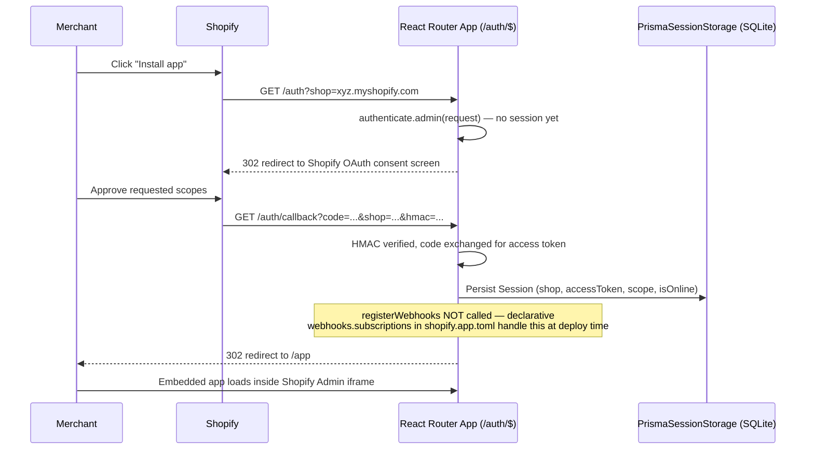
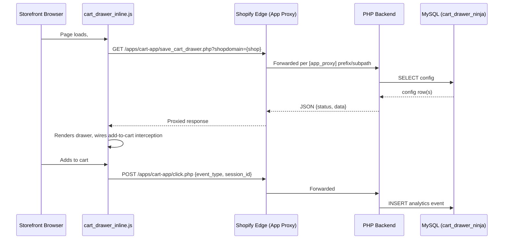

# Part 7 — Shopify Integration (Section 11)

> Part of the **Brix (The Cart Ninja) Application Knowledge Base**. See [00-INDEX.md](./00-INDEX.md).
> Verified against source (`shopify.app.toml`, `app/shopify.server.js`, `app/routes/auth.$.jsx`,
> `app/services/billing.server.js`, `app/routes/app.subscribe.jsx`, all `webhooks.*.jsx`,
> `extensions/cart-drawer/**`, and a repo-wide grep of `admin.graphql(`/`metafield`) on 2026-07-16.
> Full raw research: [research/07-shopify-integration.md](./research/07-shopify-integration.md).

## 11.1 OAuth & App Installation

Built on `@shopify/shopify-app-react-router` (`app/shopify.server.js`):

```js
const shopify = shopifyApp({
  apiKey: process.env.SHOPIFY_API_KEY,
  apiSecretKey: process.env.SHOPIFY_API_SECRET || "",
  apiVersion: ApiVersion.October25,
  scopes: process.env.SCOPES?.split(","),
  appUrl: process.env.SHOPIFY_APP_URL || "",
  authPathPrefix: "/auth",
  sessionStorage: new PrismaSessionStorage(sessionDb),
  distribution: AppDistribution.AppStore,
  future: { expiringOfflineAccessTokens: false },
});
```

- **Distribution**: `AppDistribution.AppStore` — a public/listed app.
- **`app/routes/auth.$.jsx`** is the *entire* OAuth surface — a catch-all route whose loader is
  just `await authenticate.admin(request); return redirect("/app");`. All OAuth mechanics (install
  redirect, `/auth/callback` token exchange, session persistence) happen transparently inside the
  Shopify React Router adapter's `authenticate.admin`. There is no custom `afterAuth` hook —
  **webhooks are registered declaratively** via `[[webhooks.subscriptions]]` blocks in
  `shopify.app.toml`, pushed by `shopify app deploy`/CLI, not imperatively in Node.
- `[auth].redirect_urls` in `shopify.app.toml` lists 3 valid callback targets, all under the
  current tunnel domain. `automatically_update_urls_on_dev = false` means these are **not**
  auto-rewritten when the tunnel URL changes — they must be updated manually and redeployed.

**Version-skew note**: three different Shopify API versions are in play simultaneously and are
not reconciled anywhere in code — the app backend (`ApiVersion.October25`), the declarative
webhooks block (`api_version = "2026-04"` in `shopify.app.toml`), and the theme extension
(`api_version = "2024-04"` in `shopify.extension.toml`). Worth checking during any future upgrade.



## 11.2 Session Handling

- **Storage**: `PrismaSessionStorage`, backed by an isolated SQLite database
  (`app/session-db.server.js` → `prisma/session/schema.prisma`'s `Session` model) — deliberately
  separate from the MySQL data path so login never depends on the MySQL/PHP backend being
  reachable (see [06-database.md](./06-database.md) for the full session schema).
- `webhooks.app.uninstalled.jsx` deletes all `Session` rows for the shop on uninstall.
- `webhooks.app.scopes_update.jsx` updates the stored session's `scope` field when a merchant
  grants additional permissions.
- **Background/cron code** (e.g. `billing.server.js`'s daily overage-billing job) uses
  `unauthenticated.admin(shop)` to get an Admin GraphQL client outside of a live request — this
  relies on an offline session already existing from install.

## 11.3 Scopes

```toml
[access_scopes]
scopes = "read_discounts,write_discounts,write_products,read_content,write_content,read_online_store_pages,write_online_store_pages,read_themes,read_orders"
```

| Scope | Used for |
|---|---|
| `read_discounts`, `write_discounts` | Reading/creating/updating/deleting Shopify discount codes across Combo Forge, the Coupon Manager, and the AI discount-creation flow |
| `write_products` | Declared but **no product-write GraphQL mutation was found** in the routes surveyed — the app only reads products. Not Verified whether a write path exists elsewhere. |
| `read_content`, `write_content`, `read_online_store_pages`, `write_online_store_pages` | Publishing Combo Forge bundle templates as live Shopify Pages (`pageCreate`/`pageUpdate`) |
| `read_themes` | Theme-related reads (theme editor / theme-asset compatibility, incl. the AI "match store theme" feature reading `settings_data.json`) |
| `read_orders` | Order webhooks and analytics revenue rollups |

**Important**: the scopes actually requested at OAuth time come from the `SCOPES` environment
variable (`shopify.server.js`'s `scopes: process.env.SCOPES?.split(",")`), not directly from this
TOML value — the TOML value is what gets pushed to the Partner Dashboard on `shopify app deploy`.
These must be kept in sync manually.

## 11.4 Webhooks

Declared in `shopify.app.toml` (`api_version = "2026-04"`):

| Topic | Handler | What it does |
|---|---|---|
| `app/uninstalled` | `webhooks.app.uninstalled.jsx` | Deletes all `Session` rows for the shop; notifies the legacy PHP host to mark the shop inactive |
| `app/scopes_update` | `webhooks.app.scopes_update.jsx` | Updates the stored session's `scope` field |
| `app_subscriptions/update` | `webhooks.app_subscriptions_update.jsx` | Promotes `pending_plan_key` → `plan_key` on active/pending status (or resets to `free` on cancel/decline/expire) via `confirmPlanFromWebhook`; mirrors status to the PHP backend |
| `app_purchases_one_time/update` | `webhooks.app_purchases_one_time_update.jsx` | Handles one-time-charge status transitions; **Not Verified** whether any route actually creates a one-time purchase (`appPurchaseOneTimeCreate` was not found in a repo-wide grep) — this handler may be provisioned for an unfinished feature |
| `customers/data_request`, `customers/redact`, `shop/redact` (via `compliance_topics`) | `webhooks.compliance.jsx` | The **actual, registered** GDPR handler — switches on topic, forwards to the corresponding PHP endpoint |
| `orders/paid` | `webhooks.orders.paid.jsx` | Authoritative revenue-realized signal — upserts `store_orders`/line items and applies a rollup delta, idempotently guarded against double-counting; also attributes revenue to a Combo Forge template if `note_attributes` carry a `combo_source`/`combo_template_id` |
| `orders/create` | `webhooks.orders.create.jsx` | Order/line-item capture only — no revenue applied (financial status is typically still pending) |
| `orders/updated` | `webhooks.orders.updated.jsx` | Refreshes totals/status; does not apply a rollup delta directly (relies on the 15-min reconciliation cron to correct drift) |
| `orders/cancelled` | `webhooks.orders.cancelled.jsx` | Reverses previously-counted revenue |
| `refunds/create` | `webhooks.refunds.create.jsx` | Applies a negative revenue delta against the order's original date, net-revenue style |
| `carts/create`, `carts/update` | `webhooks.carts.create.jsx`, `webhooks.carts.update.jsx` | Best-effort cart-activity signal — code comments explicitly flag this webhook's firing reliability as unproven; never treat as a sole KPI source |

Every handler calls `authenticate.webhook(request)` first, which verifies the Shopify HMAC and
401s automatically on failure.

**Known issue — orphaned GDPR route files**: `webhooks.customers.data_request.jsx`,
`webhooks.customers.redact.jsx`, and `webhooks.shop.redact.jsx` exist on disk and functionally
duplicate `webhooks.compliance.jsx`, but **are not referenced by any `[[webhooks.subscriptions]]`
block** — only the `compliance_topics` entry pointing at `/webhooks/compliance` is registered.
These three files are dead/legacy code, left over from before the app consolidated onto the
combined compliance handler. See [10-troubleshooting-security-deployment.md](./10-troubleshooting-security-deployment.md) for the cleanup recommendation.

**Known issue — two different PHP hosts across webhook handlers**: some webhook handlers
(`app.uninstalled`, `app_purchases_one_time_update`, `compliance`, and the orphaned GDPR files)
POST to the hardcoded legacy domain `https://int.thecartninja.com`, while
`app_subscriptions_update` uses `BASE_PHP_URL` (which resolves to `https://int.thecomboforge.com`
in production per `CLAUDE.md`). This split is an artifact of the app's rename history
(Cart Ninja → Brix/Combo Forge) and has not been reconciled in code.

## 11.5 App Proxy

```toml
[app_proxy]
url = "https://<current-tunnel>.trycloudflare.com/cartdrawerv2_ui/php_backend/"
prefix = "apps"
subpath = "cart-app"
```

Any storefront request to `https://<shop>.myshopify.com/apps/cart-app/<path>` is forwarded by
Shopify straight to `<app_proxy.url>/<path>` — **the Node/React Router app plays no role in
serving these endpoints.** Confirmed by grep: there are no `app/routes/*.php.jsx` files matching
`save_cart_drawer.php`, `save_coupon_slider_widget.php`, `save_fbt_widget.php`, `click.php`, or
`session_ping.php` — the PHP backend serves these directly from `php_backend/`.

Endpoints called by the storefront extension JS, all under `/apps/cart-app/`:
`save_cart_drawer.php` (GET), `save_coupon.php` (GET), `save_coupon_slider_widget.php` (GET),
`save_fbt_widget.php` (GET), `click.php` (POST, analytics), `session_ping.php` (POST, session
heartbeat).



## 11.6 Admin API Usage (GraphQL)

A repo-wide grep of `admin.graphql(` found 30 files using the Shopify Admin GraphQL API:

| Mutation / Query | Purpose |
|---|---|
| `discountCodeBasicCreate`/`Update`, `discountCodeFreeShippingCreate`/`Update`, `discountCodeBxgyCreate`/`Update`, `*Delete` variants | Full discount CRUD across the manual Coupon Manager, Combo Forge bundle discounts, and the AI discount-creation flow |
| `discountCodeActivate`/`Deactivate`, `discountAutomaticActivate`/`Deactivate`/`Delete` | Toggle/delete a single discount |
| `discountNodes(...)` (list query) + `metafield(namespace:"cart_app", key:"source")` | Powers every discount list/picker in the app; the metafield read flags app-created discounts, though **no corresponding write path for that metafield was found** (see §11.9) |
| `products(first: N)` | Product pickers across Cart Drawer upsells, FBT rules, Combo Forge |
| `collections(first: N)` / `collectionByHandle` / `collection(id)` | Collection-scoped pickers and Combo Forge collection rules |
| `pages(first: N)` / `pageByHandle` / `pageCreate` / `pageUpdate` | Publishing a Combo Forge bundle template as a live Online Store page |
| `shop { primaryDomain { url } }` | Resolves the storefront URL for the AI theme-matching feature |
| `currentAppInstallation { activeSubscriptions { ... } }` | Reads the shop's active Shopify Billing subscription and usage line items |
| `appSubscriptionCreate` / `appSubscriptionCancel` | Creates/cancels the shop's recurring or usage-only subscription |
| `appUsageRecordCreate` | Records a metered usage charge (order overage or AI credit overage) |

**Notable pattern**: usage-pricing line items carry a free-text `terms` string (e.g. `"$0.30 per
order above 500 orders/month."`), and the billing code locates the correct line item at charge
time by matching a **substring of that string**, not a stable ID — a subscription can carry both
an order-overage and an AI-credit-overage usage line item simultaneously.

## 11.7 Theme App Extension

```toml
# extensions/cart-drawer/shopify.extension.toml
api_version = "2024-04"
[[extensions]]
name = "Cart Ninja"
handle = "cart-ninja"
type = "theme"
```

A single **theme app extension**, still registered under the legacy name "Cart Ninja"/`cart-ninja`
handle (not "Brix"). It bundles 4 Liquid blocks, 1 snippet, and a set of JS/CSS assets.

| Block | Target | Enabled on | Merchant-configurable in Theme Editor? | Behavior |
|---|---|---|---|---|
| `cart_drawer.liquid` ("Custom Cart Drawer") | `body` | all templates (global app-embed) | No (static container only) | Renders `<div id="cc-root">`; loads `cart_drawer_inline.js`/`.css` via `asset_url` — **the only block that loads external asset files** |
| `coupon_slider.liquid` ("Coupon Banner") | `body` | `product` only | No (static info paragraph; real config is in the app admin) | Fully self-contained — all JS/CSS inlined directly in the `.liquid` file. Fetches `save_coupon_slider_widget.php` via App Proxy, matches display-condition rules, renders one of 3 hardcoded card templates, click-to-copy code |
| `Fbt.liquid` ("FBT Widget") | `body` | `product` only | No | Same self-contained pattern. Fetches `save_fbt_widget.php`, resolves applicable rule, renders one of 3 layouts (`classic-grid`/`modern-cards`/`vertical-list`) with 3 interaction models, adds to cart via `/cart/add.js` |
| `star_rating.liquid` ("Star Rating") | `section` | manual placement | Yes — product picker + star color | Reads a `demo.avg_rating` **product metafield** — a namespace this app does not appear to write anywhere; likely a placeholder/demo block or intended integration point for a third-party reviews app |

`snippets/stars.liquid` — pure presentational partial used only by `star_rating.liquid`.

### Extension Assets — active vs. dead code

A grep of every `.liquid` file for asset references found **exactly one** load site in the whole
extension: `cart_drawer.liquid`'s `asset_url` calls for `cart_drawer_inline.js`/`.css`. Everything
else under `extensions/cart-drawer/assets/` is not loaded by any block:

| Asset | Status |
|---|---|
| `cart_drawer_inline.js` (2240 lines) / `.css` (306 lines) | **Active** — the real, currently-shipping cart-drawer engine |
| `cart_drawer.js` (1025 lines) / `.css` | Dead — an older, smaller superseded implementation |
| `cartdrawer.js` (66 lines) / `.css` | Dead — an even earlier prototype targeting a different container ID (`#app-cart-modal`) |
| `coupon-slider.js` (**0 bytes, empty**) / `.css` | Dead |
| `coupon_slider.js` (258 lines) / `.css` | Dead — superseded by the logic now inlined in `coupon_slider.liquid` |
| `fbt_widget.js` (636 lines, contains unrendered Liquid syntax) / `.css` | Dead — superseded by the logic now inlined in `Fbt.liquid` |
| `thumbs-up.png` | **Active** — used by Star Rating |

10 of 13 non-image asset files are dead weight (still pushed to Shopify's CDN on every
`npm run deploy`, but never executed on the storefront). See
[10-troubleshooting-security-deployment.md](./10-troubleshooting-security-deployment.md) for the
cleanup recommendation.

### `cart_drawer_inline.js` — the one active asset, key behaviors

- Reads config via App Proxy (`CONFIG_API`, `COUPON_API`), posts click events (`CLICK_API`) and a
  session heartbeat (`SESSION_API`) fire-and-forget.
- Client-side session tracking via a `localStorage` id with a 30-minute rolling expiry (explicitly
  documented as an approximation, not consent-gated analytics).
- **Cart-open detection uses 9+ independent, redundant strategies** simultaneously (patched
  `fetch`/`XHR`, form-submit interception, `/cart.js` polling, ~25 known theme-specific custom
  events, ATC/cart-icon click delegation, `MutationObserver`s on cart-count badges and drawer
  open-state classes, `history.pushState` interception) — necessary because the app cannot rely on
  any single theme's cart-open convention across Dawn, Debut, Brooklyn, Impulse, and other themes.
- Confetti effect lazy-loads `canvas-confetti` from a third-party CDN
  (`cdn.jsdelivr.net`) — the **only external, non-Shopify network dependency** in the extension.

## 11.8 App Embed vs App Blocks

The extension is a **Theme App Extension** (not a legacy "App Embed" script-tag integration) —
merchants enable it via **Online Store → Themes → Customize → App Embeds** (toggling the overall
extension on) and then add individual blocks (Cart Drawer, Coupon Banner, FBT Widget, Star Rating)
via **Add block** in the Theme Editor, per `USER_GUIDE.md`'s installation walkthrough. This
requires zero theme code edits and works with any Online Store 2.0 theme.

## 11.9 Discount APIs

Covered in full in §11.6. Summary: the app supports creating/editing/deleting all three Shopify
discount code types (Basic %, BXGY, Free Shipping) through its own Coupon Manager UI, through
Combo Forge's bundle-discount step, and through the AI chat discount-creation flow — all via real
`discountCode*` GraphQL mutations, never simulated.

## 11.10 Metafields

Metafield usage in this codebase is **read-only** — no `metafieldsSet`/`metafieldSet` mutation was
found anywhere in `app/`.

1. `cart_app`/`source` metafield on discount nodes — read to flag `isAppCreated` in the Coupon
   Manager list UI. **No write path exists** for this metafield in any discount-creation mutation
   found — Not Verified whether it's set by the PHP backend or is simply always empty in practice.
2. `demo`/`avg_rating` product metafield — read by `star_rating.liquid`. Reads like placeholder/
   demo code or an integration point for a third-party reviews app this codebase doesn't own.

## 11.11 Billing

Full Shopify Billing API integration — subscriptions plus metered usage charges.

### Plan tiers (`app/config/plans.js`)

| Plan | Monthly price | Order cap | Order overage rate | AI credits/mo | AI overage rate | Combo templates | Watermark removable |
|---|---|---|---|---|---|---|---|
| Free | $0 | 50 | $0.10/order | 10 | $0.01/credit | 0 (locked) | No |
| Starter | $29 ($290/yr) | 500 | $0.30/order | 30 | $0.03/credit | 3 | Yes |
| Pro | $79 ($790/yr) | Unlimited | — | 90 | $0.09/credit | Unlimited | Yes |

A parallel `FEATURES` registry maps ~18 feature keys to a per-plan state — `enabled`, `preview`
(editable but must not render live on the storefront — this is the mechanism behind the "🔒 not
available on your plan" placeholders in the Coupon Banner/FBT Liquid blocks), or `locked`.

### Subscription flow

1. **Every plan, including Free, creates a Shopify subscription** — because a usage charge can
   only attach to a line item inside an active subscription, so even Free gets a usage-only
   subscription purely to carry the AI-credit-overage line item.
2. Paid plans get a recurring price line item, an optional order-overage usage line item, and
   always the AI-credit-overage usage line item, all in one `appSubscriptionCreate` call with a
   14-day trial.
3. Downgrading to Free cancels the active subscription first, then creates the Free usage-only one.
4. The intended plan is recorded via `setPendingPlanKey` before redirecting to Shopify's
   confirmation page; the `app_subscriptions/update` webhook is what actually promotes
   `pending_plan_key` → `plan_key` once Shopify confirms the subscription is active. The billing
   dashboard also independently re-checks on every visit as a race-condition safety net.

### ⚠️ Production-readiness flag — billing is currently in test mode

`app/routes/app.subscribe.jsx` contains two explicit, commented dev-only bypass flags:

- **`TEMP_INSTANT_PLAN_SWITCH = true`** — skips the entire real Shopify billing flow and applies
  plan switches instantly, because dev stores have no real payment method and
  `appSubscriptionCreate` always fails approval on them. The code comment explicitly states this
  **must be flipped to `false` before any real merchant uses the app.**
- **`test: true`** — hardcoded on both `appSubscriptionCreate` calls, marking every subscription
  as a Shopify test charge (never actually billed). Also explicitly commented as needing to be
  replaced with a real prod/dev condition before launch.

**As the code currently stands, this app does not charge real money.** This is a load-bearing
fact for any assessment of production readiness — see
[10-troubleshooting-security-deployment.md](./10-troubleshooting-security-deployment.md) and
[11-future-glossary-appendix.md](./11-future-glossary-appendix.md).

### Usage/overage billing mechanics

- `chargeOverageForShopDate` — computes `(orderCount - orderCap) * overageRate` per shop/day,
  idempotent via a status pre-check.
- `runDailyOverageBilling` — the cron entry point (registered in `scheduler.server.js`, fires
  00:15 UTC daily), iterates every shop with orders yesterday and charges overage via
  `unauthenticated.admin(shop)`.
- `chargeAiCreditOverage` — charges one AI credit at a time, called live from AI routes; idempotent
  per `(shop, period, credit_number)`.
- All charges are hardcoded to `currencyCode: 'USD'` regardless of the shop's actual currency.

### One-time purchases

A webhook handler exists for `app_purchases_one_time/update` status transitions, but **no route
creating an `appPurchaseOneTimeCreate` mutation was found** — Not Verified whether one-time
purchases are wired up anywhere in this codebase today.
