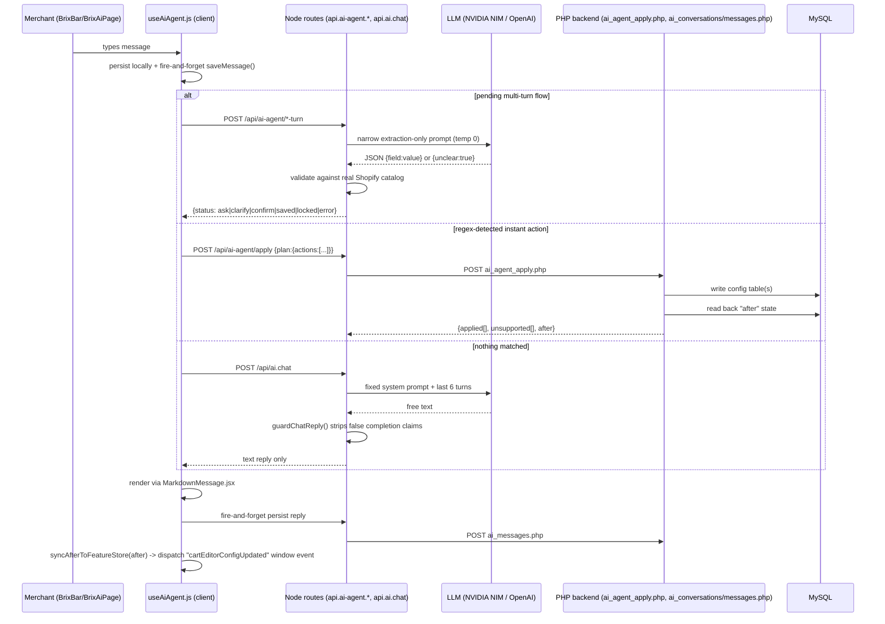
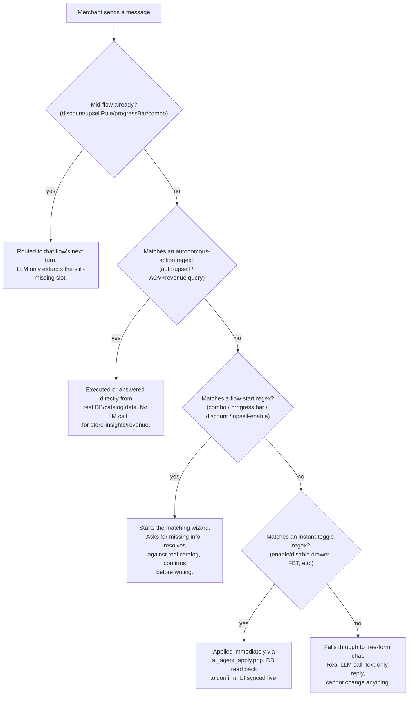

# Part 8 — AI Documentation (Section 12) & AI Training Knowledge Base (Section 16)

> Part of the **Brix (The Cart Ninja) Application Knowledge Base**. See [00-INDEX.md](./00-INDEX.md).
> Verified directly against source code on 2026-07-16. This is the single most safety-critical
> section of this knowledge base — every claim below is either quoted from code or explicitly
> marked "Not Verified from Source Code." Do not embellish AI capabilities beyond what is written
> here when answering merchant questions.

**Naming correction vs. older docs**: `CLAUDE.md`, `BRD.md`, `USER_GUIDE.md`, and `BRIX_OVERVIEW.md`
all describe **two** AI systems ("CartNinja" floating chat + "BrixBar" builder-only bar).
**This is stale.** `CartNinjaAgentV2.jsx`, `CartNinjaFloatingLauncher`, and
`api.ai-agent.generate.jsx` do not exist anywhere in the current codebase — only stale mentions
in markdown remain. There is exactly **one** AI system today, branded **Brix**, and it is mounted
far more broadly than CLAUDE.md's "combo builder pages only" claim (see §12.1).

---

## 12. AI Documentation

### 12.1 Architecture — what exists today

One client-side hook (`app/components/ai-agent/useAiAgent.js`) is the entire brain — conversation
state, intent detection, multi-turn flow orchestration, credit tracking, localStorage caching.
Two UI components call it:

| Component | Role |
|---|---|
| `BrixBar.jsx` | Compact pill that expands into a floating or inline chat panel (`size="lg"/"md"/"sm"`). |
| `BrixAiPage.jsx` | Full-page ChatGPT-style UI, mounted only at `/app/brix-ai`. |

`BrixBar` is mounted in **9 places**: `/app/fbt`, `/app/coupons`, `/app/bundles` (dashboard),
the Cart Drawer editor sidebar (`CartEditorSidebar.jsx`, inline not floating), `/app/bundles/customize`
(twice — a template-picker gate render and the main builder render, which are mutually exclusive,
not simultaneous), `/app/analytics`, `/app/additional`, `/app/productwidget`. Plus the dedicated
full-page route `/app/brix-ai`.

Supporting files: `api.js` (fetch wrapper), `featureStore.js` (localStorage widget-state cache for
optimistic UI sync), `MarkdownMessage.jsx` (lazy-loaded `react-markdown` renderer).

**The most important architectural fact**: most user messages never reach an LLM at all. A cascade
of **client-side regex intent detectors** in `useAiAgent.js` runs first, in this priority order:

1. Continue a pending multi-turn flow, if one is active.
2. `looksLikeAutoUpsellIntent` → `/api/ai-agent/auto-upsell` (no LLM — real basket-analysis SQL).
3. `looksLikeAovQuery` → `/api/ai-agent/store-insights` (no LLM — templated from real DB data).
4. `looksLikeComboIntent` → starts the `combo` wizard flow.
5. `looksLikeProgressBarIntent` → starts the `progressBar` wizard flow.
6. `looksLikeDiscountIntent` → starts the `discount` wizard flow.
7. `isRevenueQuery` → direct fetch of `/api/analytics/summary` (no LLM).
8. `extractActions(text)` (regex module matcher for instant toggles) → `/api/ai-agent/apply`.
9. **Only if nothing above matched** → free-form chat via `/api/ai.chat` (a real LLM call, but
   purely conversational — it cannot execute anything, see §12.3).



### 12.2 What the AI can do (full capability inventory, quoted/verified from code)

**A. Deterministic instant actions** — `ai_agent_apply.php`'s `switch($action)` is the
authoritative list of what actually writes to the database:

| Action | Effect |
|---|---|
| `enableDrawer` / `disableDrawer` | Toggles `cart_drawer_config.is_enabled` (+ legacy mirror); optional drawer position (left/right) |
| `enableGoalBar` / `disableGoalBar` | Toggles `progress_bar_settings.is_enabled`; can set completion text, placement, and update the **first** `progress_bar_tiers` row only |
| `enableUpsell` / `disableUpsell` | Toggles `upsell_widget_settings.is_enabled` |
| `enableFBT` / `disableFBT` | Toggles `fbt_widget_settings.is_enabled`; optional template/mode |
| `applyTheme` | Writes header/checkout button colors to `cart_drawer_config` + legacy blob, used by the theme-matching feature |

Everything else the client can *recognize* — `enableTrustBadges`/`disableTrustBadges`,
`applyTemplate` (preset themes "Premium Dark"/"Minimal Light"/"Luxury Gold"), `optimizeMobile` —
falls into PHP's `default:` branch and is explicitly pushed to an `$unsupported` list, **never**
`$applied`. The code comment is direct: *"Must NOT be added to $applied, or the caller will
report 'Completed' for a no-op."* **These three are recognized-but-not-implemented — always
report them as unavailable, never as done.**

**B. Match Store Theme** (`/api/ai-agent/match-theme`) — detects real theme colors by (1) reading
the live theme's `settings_data.json` via the Admin Theme Assets API, or (2) falling back to
scraping the storefront's live CSS custom properties. Returns an honest failure and asks for
explicit color codes if neither source yields usable colors. On success, applies via the same
`applyTheme` action as §A.

**C. Four multi-turn wizard flows** (ask → clarify → confirm → saved, real validation, explicit
choice-chip confirm step before any write):

1. **Upsell rule** (`/api/ai-agent/upsell-rule-turn`) — resolves trigger + offer products against
   the real Shopify catalog (exact match wins, 2+ matches → pick-list, never guessed); on confirm,
   appends to `upsell_widget_settings.manual_rules`. Plan-gated (`ai_cart_upsell`).
2. **Discount creation** (`/api/ai-agent/discount-turn`) — extracts code/%/dates/title; if no
   title given, **auto-generates one** (`"${percentage}% Off Storewide"`) rather than leaving it
   blank; on confirm, calls the real Shopify `discountCodeBasicCreate` GraphQL mutation.
3. **Progress bar setup** (`/api/ai-agent/progress-bar-turn`) — slot-filling wizard (reward type →
   goal amount → placement) with closed-set choice chips; finalizes via the same `enableGoalBar`
   action as §A.
4. **Combo/bundle creation** (`/api/ai-agent/combo-turn`) — resolves a real collection, plan-gated
   (`build_a_combo`) and template-count-gated; writes a **draft, inactive** `combo_templates` row —
   the merchant must open the builder to review and publish it, the AI never publishes directly.

All four flows share one client-side state machine, bail out to the manual UI after **3 failed
clarify attempts**, and never persist `pendingAction` to localStorage (deliberately — a stale
pending clarification surviving a reload could hijack an unrelated later message).

**D. Autonomous no-question actions**:
- **Auto-upsell** ("recommend the best upsell for me") — real basket co-purchase SQL analysis
  over `store_order_line_items`/`store_orders` (2-year window), falls back to best-seller pairing,
  returns an honest `insufficient-data` status rather than a fabricated pair if there's not enough
  order history. Re-reads the DB after writing to verify the rule actually saved before reporting
  success.
- **Store insights / AOV report** — read-only, **zero LLM calls**, entirely templated from real
  DB/catalog queries specifically to avoid presenting a fabricated number as fact.
- **Revenue query** — direct fetch of the real analytics summary endpoint, no LLM involved.

**E. Free-form chat** (`/api/ai.chat`) — the only genuinely open-ended LLM call in the app.
**Cannot execute any action** — text output only. See §12.3 for the enforced boundary.

### 12.3 What the AI explicitly cannot / should not do

The free-form chat system prompt (`api.ai.chat.jsx`) states, verbatim:

> "You have no ability to change any setting or create anything here, and nothing you say is
> executed against the merchant's store... Never say or imply you enabled, created, configured,
> updated, applied, fixed, or turned on/off anything... Never promise future action... Never state
> specific store data you were not given in this conversation... Never state a specific date,
> version, or 'as of' fact you're not certain of."

This is backed by a **code-level regex guardrail**, not just prompt compliance
(`app/services/ai-safety.server.js`, the entire file's purpose):

```js
const COMPLETION_CLAIM_RE = /\bI(?:'ve| have)?\s+(enabled|disabled|turned (on|off)|created|added|configured|updated|applied|fixed|set up|removed|deleted)\b/i;
const FUTURE_PROMISE_RE = /\bI(?:'ll| will)\s+(notify|monitor|watch|keep (an eye|track)|follow up|check back|let you know)\b/i;
```

If a free-form reply trips either pattern, a corrective note is appended before it reaches the
merchant. This guard is scoped **only** to the free-form chat path — the wizard/apply routes never
claim completion except after a real, verified database write, so they don't need it.

**Plan gating** (`app/services/plan-permissions.server.js` + `app/config/plans.js`):

| Feature | Free | Starter | Pro |
|---|---|---|---|
| Chat itself (`ai_brix`) | Enabled (credit-limited, not plan-locked) | Enabled | Enabled |
| Publishing AI-created upsell rules (`ai_cart_upsell`) | Preview only — writes locked | Enabled | Enabled |
| Full analytics in store-insights (`full_analytics`) | Locked — falls back to catalog-only insights | Enabled | Enabled |
| Combo/bundle creation (`build_a_combo`) | Locked | Enabled (template-count-limited) | Enabled |

**Other guardrails**: every AI route requires an authenticated Shopify admin session
(`authenticate.admin`); Node→PHP calls carry an `X-Forge-Secret` header checked against
`SHOPIFY_API_KEY` server-side; question-phrasing is disambiguated from commands (`looksLikeQuestion`)
so "is upsells enabled?" never fires the same path as "enable upsells."

**Not Verified from Source Code**: no dedicated prompt-injection filter exists beyond narrowly
scoped extraction prompts (JSON-only, low token limits, temperature 0); no rate-limit-specific
handling (429s are treated as generic API errors) was found.

### 12.4 Decision process / intent classification

See the numbered cascade in §12.1 — classification is entirely **client-side, regex/keyword-based**,
not an LLM function-calling or classifier model. The LLM is only ever invoked for (a) free-form
chat replies, or (b) narrow single-field JSON extraction inside an already-classified flow. The
LLM never decides *which* action to take — that decision is made by regex before any LLM call
happens.

### 12.5 Prompt handling

Centralized in `app/services/ai-llm.server.js`, with the same provider-resolution logic CLAUDE.md
describes (still accurate):

```js
const isNvidia = (process.env.OPENAI_API_KEY || '').startsWith('nvapi-');
// isNvidia -> NVIDIA NIM endpoint, model meta/llama-3.1-8b-instruct
// else     -> OpenAI endpoint, model gpt-4o-mini
```

- **Free-form chat**: fixed ~600-word system prompt (not built from live store data) + last 6
  turns of client-side history. Explicitly told it has "no live access to the store." No product
  catalog, no config state, no page context is ever injected.
- **Extraction prompts** (the 4 wizard flows): each route has its own narrow prompt asking for
  JSON only, temperature 0, 100–150 max tokens, and only the current message as context — no
  conversation history is sent to extraction calls (multi-turn slot state is carried by the
  client and round-tripped as explicit fields instead).

No page/DOM state, product catalog, or live store data is ever placed directly into an LLM prompt
anywhere in this codebase. Where store facts matter (product/collection resolution, catalog
snapshots, revenue figures), they are fetched via direct Shopify GraphQL/DB queries **after** LLM
extraction and validated against real records — the LLM only ever extracts intent/parameters from
free text, never asserts facts about the store.

### 12.6 Action execution & validation flow

Representative walkthrough (`upsellRule` flow):

1. `authenticate.admin` — no session, no execution.
2. Plan gate checked (`canPublishFeature`) before any credit is spent or LLM called.
3. Credit consumed, LLM extracts whichever slot (trigger/offer) is still unresolved.
4. Each product name is resolved against the **real** catalog via GraphQL — exact match wins,
   2+ matches shown as a pick-list, no match returns an explicit "couldn't find" message. Never
   guessed.
5. Once both sides are resolved, the route returns `status:'confirm'` with a plain-language
   summary and Confirm/Cancel choice chips. **Nothing is written yet.**
6. Only on explicit confirm (`finalize:true`) does the database write happen.
7. The client's success message is built from the **route's returned data**, never a canned
   string — enforced by an explicit code comment against rephrasing to imply something happened
   before the write succeeded.

The instant-action path has no confirm step (it applies immediately) but still reads back the
real post-write DB state and syncs it into the editor UI via a `cartEditorConfigUpdated` window
event, rather than assuming the write succeeded.

### 12.7 Fallback logic / error handling

| Failure mode | Handling |
|---|---|
| LLM HTTP error | Logged server-side; chat returns an HTTP-status-aware apologetic message (still HTTP 200, `success:true`, so the UI shows a normal agent bubble, not a broken-fetch error) |
| Malformed/unparseable LLM JSON | `parseJsonReply` strips code fences, falls back to `{unclear:true}` → routes to a "clarify" ask-again response; no action is ever taken on unparseable output |
| Any thrown exception in a route handler | Caught, logged server-side, returns a generic `status:'error'` message — never leaks a stack trace |
| Client-side network failure | Generic "something went wrong, try again" message |
| Rate limits (429) | **Not Verified from Source Code** — no special handling found; treated as a generic API error |
| PHP-side DB errors | **Not Verified from Source Code** whether a global exception handler exists upstream of `ai_agent_apply.php`'s raw PDO calls — no try/catch was found in that file itself |

### 12.8 Hallucination prevention

Five concrete, code-level mechanisms (this is the real, current implementation of what project
history refers to as the "truthfulness redesign" — not just a plan):

1. **`guardChatReply`** — regex backstop against false completion/future-promise claims in chat (§12.3).
2. **Evidence-gated success messages** — a timestamp is only shown in a success message if the
   backend's response actually contained a real `updatedAt` value; never fabricated.
3. **Store-insights makes zero LLM calls** — entirely templated from live data, specifically to
   avoid presenting a fabricated number as fact (explicit code comment).
4. **Verify-after-write** — the auto-upsell flow re-reads the database after writing and only
   reports success if the write is independently confirmed present.
5. **Product/collection resolution never guesses** — ambiguous or missing matches are surfaced to
   the merchant to disambiguate, never silently picked.

There is **no cross-check of LLM-generated prose against a second data source after the fact** —
the strategy is entirely "never let the LLM assert facts it wasn't given" (prompt + regex) plus
"never let a success message get ahead of a confirmed DB write," not post-hoc fact-checking.

### 12.9 Permission checks

- Every `/api/ai*` and `/api/ai-agent/*` route requires `authenticate.admin(request)`.
- Node → PHP AI calls carry `X-Forge-Secret: SHOPIFY_API_KEY`; PHP 403s on mismatch.
- Feature-level plan gates (§12.3 table) block AI **writes** for locked features but never block
  the chat itself — chat is credit-metered, not plan-locked (see §12.10).

### 12.10 AI credit / billing model

Confirmed exactly, read directly from `app/config/plans.js` and `app/services/ai-credits.server.js`:

| Plan | Monthly credit cap | Overage rate per credit past cap |
|---|---|---|
| Free | 10 | $0.01 |
| Starter | 30 | $0.03 |
| Pro | 90 | $0.09 |

- One credit = one call to `checkAndConsumeCredit()`, charged by chat and every wizard-flow turn
  and auto-upsell — **not** charged by the purely-templated `store-insights` route or the
  no-LLM instant-apply/match-theme routes.
- Usage tracked per `(shop_domain, YYYY-MM)` in MySQL table `ai_brix_credit_usage`.
- **Usage is never blocked at the cap.** Past the limit, each additional credit triggers a real
  Shopify usage billing charge (`ai_brix_overage_charges` table, idempotent per credit number) via
  `createUsageCharge()`. This is genuine Shopify Billing API usage, not simulated.
- The BrixBar/BrixAiPage header shows `${remaining}/${limit} credits`, switching to an
  `Overage $X.XX/credit` display once the cap is exceeded.

### 12.11 Conversation history persistence

Entirely on the **PHP/MySQL side** (`ai_conversations`, `ai_messages` tables via
`ai_conversations.php`/`ai_messages.php`), proxied by thin authenticated Node routes. **Not**
Prisma/SQLite, despite an old, no-longer-referenced Prisma migration file for an
`ai_agent_history` table — history storage was migrated off Prisma onto PHP/MySQL at some point,
and the corresponding Node service file no longer exists. Persistence from the client is
explicitly **fire-and-forget** (`.catch(() => {})`) — `messages` React state plus a localStorage
mirror are the actual source of truth for the live session; MySQL exists so history "survives
reloads/devices," per the code's own comment. No conversation history is ever sent back into an
LLM prompt except the last 6 turns of the free-form chat route.

---

## 16. AI Training Knowledge Base

*This section is written so another AI model (or a human support agent) can correctly answer
merchant questions about Brix's AI assistant without overstating its capabilities.*

### 16.1 Terminology

| Term | Definition |
|---|---|
| **Brix** | The current name of both the app and its AI assistant. Formerly "CartNinja" in older docs/branding — that AI system no longer exists in code. |
| **BrixBar** | The compact, expandable AI chat widget embedded on most `/app/*` admin pages. |
| **Brix AI / BrixAiPage** | The full-page chat UI at `/app/brix-ai`. Same backend/hook as BrixBar. |
| **Flow / wizard** | One of the 4 guided multi-turn conversations (upsell rule, discount, progress bar, combo) that end in an explicit confirm step before writing anything. |
| **Instant action** | A toggle-style action (enable/disable a widget) applied immediately with no confirm step. |
| **Credit** | One unit of AI usage, consumed by chat replies and flow turns; capped per plan per month, with paid overage beyond the cap. |
| **Applied / Unsupported** | The two buckets `ai_agent_apply.php` sorts every requested action into — only `applied` actions actually changed something. |

### 16.2 Correct vs incorrect answers — worked examples

**Q: "Can Brix's AI turn on my upsell widget for me?"**
- ✅ Correct: "Yes — say 'enable upsells' and it applies immediately. Then it'll ask if you want to set up a trigger/offer rule, or you can do that manually in the Upsell page."
- ❌ Incorrect: "Yes, it will automatically pick the best upsell products for you the moment you enable it." (Enabling and auto-recommending are two separate, separately-triggered actions — enabling alone does not run the recommendation logic.)

**Q: "Can I ask Brix to apply the 'Premium Dark' theme preset?"**
- ✅ Correct: "The assistant recognizes that request but there's no backend implementation for preset themes yet — it will tell you it's not available. You can still ask it to 'match my store theme,' which is a different, implemented feature that reads your live theme colors."
- ❌ Incorrect: "Yes, just ask and it'll apply the preset instantly."

**Q: "Does the AI know how much revenue my store made this month if I just ask in chat?"**
- ✅ Correct: "If you phrase it as a revenue question (e.g. 'how much revenue this month'), it fetches your real analytics data directly — no LLM guessing involved. But the free-form chat itself is never given your store's revenue in its prompt and will not state a number unless that specific code path fired."
- ❌ Incorrect: "The AI has full knowledge of your store's sales at all times during any conversation."

**Q: "If I ask Brix to create a discount, does it just do it?"**
- ✅ Correct: "It extracts the details, resolves them, and shows you a summary with Confirm/Cancel — nothing is created in Shopify until you confirm."
- ❌ Incorrect: "It creates the discount code the moment you mention wanting one."

**Q: "Will the AI ever tell me it did something it didn't?"**
- ✅ Correct: "The app has specific safeguards against this — a system prompt and a code-level regex both block the chat from claiming to have enabled/created/changed anything, since chat cannot execute actions. Action-executing routes only report success after they've re-read the database to confirm the write happened."
- ❌ Incorrect: "No, it's impossible for it to ever be wrong." (The regex guard is a backstop, not a semantic guarantee — see §12.7's "Not Verified" callouts on edge cases.)

### 16.3 Decision tree — "what will happen if a merchant sends message X?"



### 16.4 Entity extraction reference

Entities the wizard flows extract and how they're resolved (never taken at face value from the LLM):

| Entity | Extracted by | Resolved against |
|---|---|---|
| Product name (trigger/offer) | LLM (loose text) | Real Shopify catalog via GraphQL `products(query:"title:*name*")` — exact match, ambiguous pick-list, or not-found |
| Collection name | LLM (loose text) | Real Shopify catalog via GraphQL, same resolution pattern |
| Discount code / percentage / dates / usage limit | LLM (loose text → structured JSON) | Not resolved against existing data (new object being created); missing title auto-defaulted |
| Reward type / goal amount / placement (progress bar) | Chip selection first, LLM extraction only for unmatched slots | Closed enum set defined in the flow's own code |
| Layout choice (combo) | LLM maps phrasing to `layout1`/`layout2`/`layout4` | `layout3` is explicitly excluded from AI-driven creation ("too complex") |

### 16.5 Feature relationships (what the AI can and cannot touch, at a glance)

| Feature | AI can enable/disable | AI can configure details | AI can create new items |
|---|---|---|---|
| Cart Drawer | Yes | Position only | N/A |
| Progress Bar | Yes | Goal amount, reward type, placement (first tier only) | No (multi-tier setup is manual-UI only) |
| Upsell widget | Yes | N/A | Yes, via the upsellRule flow or auto-upsell |
| FBT | Yes | Template, mode | No |
| Trust Badges | **No** (regex-recognized, not implemented) | — | — |
| Theme color matching | N/A | Yes (reads live theme/CSS) | — |
| Theme presets | **No** (regex-recognized, not implemented) | — | — |
| Discounts | N/A | N/A | Yes, real Shopify discount |
| Combo/bundle pages | N/A | N/A | Yes, as a draft — publish is manual |
| Mobile optimization | **No** (listed as a "tool" but not implemented) | — | — |

### 16.6 Response guidelines for an AI trained on this app

1. Never claim BrixBar can perform an action from the "recognized but not implemented" list
   (trust badges, theme presets, mobile optimization) — always describe these as not currently
   available, per §12.2A.
2. Never state that free-form chat can change settings — only the instant-action and flow paths
   can, and even those apply only after passing plan gates and (for flows) an explicit confirm step.
3. When asked about revenue/analytics numbers "through the AI," clarify that these come from real
   templated data lookups (store-insights, revenue query), not from the LLM itself.
4. When describing multi-turn flows, always mention the confirm step — nothing is written to the
   store before the merchant confirms.
5. Do not claim the AI has memory of the merchant's full store state beyond what a specific route
   explicitly fetches — the free-form chat prompt has no live store context at all.

### 16.7 Conversation & escalation rules

- If a merchant's request maps to an "unsupported" action (§12.2A), the correct response is to say
  so plainly and point to the relevant manual settings page — never to imply it will be available
  "soon" (the codebase has no roadmap commitment mechanism; do not fabricate one).
- If a flow fails 3 clarification attempts, the app itself bails to manual UI — an AI answering
  support questions about this should mirror that guidance (send the merchant to the relevant
  settings page) rather than continuing to guess at intent.
- Billing/credit questions should be answered using the exact numbers in §12.10 — do not
  round or approximate the caps or overage rates.

### 16.8 Safety rules

- Never present a merchant-facing capability as certain if this document marks it "Not Verified
  from Source Code" (prompt-injection defenses, rate-limit handling, PHP-side global error
  handling) — say it's unconfirmed rather than guessing.
- Never claim the AI can access data it wasn't given — reiterate the "no live store context in
  free-form chat" fact from §12.5 when relevant.

### 16.9 FAQs (merchant-facing)

| Question | Answer |
|---|---|
| "Is Brix AI the same as CartNinja AI?" | Yes — Brix is the current, only name for it. "CartNinja" is legacy branding still present in some older docs but not in the live app. |
| "Will using the AI cost extra?" | Not until you exceed your plan's monthly credit cap (10/30/90 for Free/Starter/Pro); after that, each additional AI action is billed via Shopify at $0.01/$0.03/$0.09 respectively. |
| "Can the AI create a Shopify discount code for me?" | Yes, after you confirm the details it proposes — it uses Shopify's real discount-creation API. |
| "Can the AI publish a bundle page automatically?" | No — it can draft one, but publishing requires opening Combo Forge and clicking Publish yourself. |
| "Does the AI know my store's exact sales figures at all times?" | No — only specific request types (revenue queries, store insights) fetch real figures; general chat has no access to your store data. |
| "What happens if the AI can't understand what I'm asking?" | It will ask a clarifying question up to 3 times, then suggest you use the relevant settings page directly. |

### 16.10 Troubleshooting (AI-specific)

| Symptom | Likely cause | What to check |
|---|---|---|
| AI returns no response / generic error | LLM provider unreachable or `OPENAI_API_KEY` misconfigured | Confirm the env var holds a valid `nvapi-*` (NVIDIA NIM) or OpenAI key; check server logs for the HTTP status logged by `ai-llm.server.js` |
| AI says an action isn't available | The action is in the "recognized but not implemented" list (§12.2A) | This is expected behavior, not a bug — confirm against the capability table in §16.5 |
| Credit count seems wrong | Only LLM-touching routes consume credits | Store-insights and instant-apply/match-theme routes intentionally consume zero credits |
| Chat history missing after reload on a different device | MySQL persistence is fire-and-forget; a failed/slow persist call won't block the UI but may not have landed yet | Not a hard failure — the local session state is authoritative for the current browser/device |
