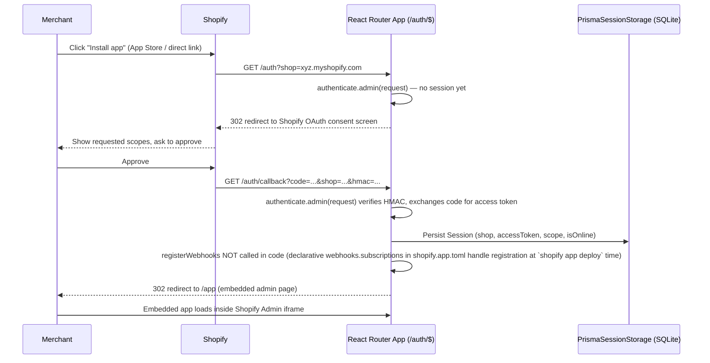
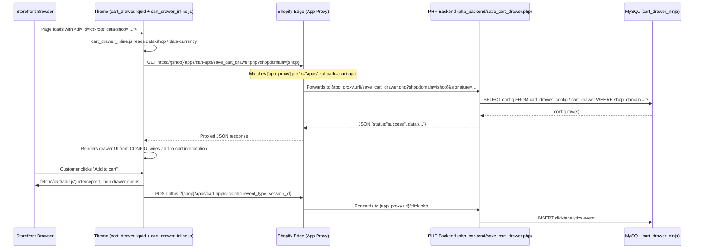

# 07 — Shopify Platform Integration

This section documents the complete Shopify platform integration surface of the app: OAuth/install, session handling, scopes, webhooks, the App Proxy, Admin GraphQL API usage, the Theme App Extension (Liquid blocks + JS assets), billing, and metafield usage.

Sources read directly for this document: `shopify.app.toml`, `app/shopify.server.js`, `app/routes/auth.$.jsx`, `app/services/billing.server.js`, `app/routes/app.subscribe.jsx`, `app/routes/app.billing.jsx`, `app/config/plans.js`, `app/services/plan-permissions.server.js`, all `app/routes/webhooks.*.jsx` files, `extensions/cart-drawer/shopify.extension.toml`, all files under `extensions/cart-drawer/blocks/` and `extensions/cart-drawer/snippets/`, and all `.js`/`.css` files under `extensions/cart-drawer/assets/`, plus a repo-wide grep of `admin.graphql(` and `metafield`.

---

## OAuth & App Installation

The app is built on `@shopify/shopify-app-react-router` (`app/shopify.server.js`). Configuration:

```js
const shopify = shopifyApp({
  apiKey: process.env.SHOPIFY_API_KEY,
  apiSecretKey: process.env.SHOPIFY_API_SECRET || "",
  apiVersion: ApiVersion.October25,
  scopes: process.env.SCOPES?.split(","),
  appUrl: process.env.SHOPIFY_APP_URL || "",
  authPathPrefix: "/auth",
  sessionStorage: new PrismaSessionStorage(sessionDb),
  distribution: AppDistribution.AppStore,
  future: { expiringOfflineAccessTokens: false },
  ...(process.env.SHOP_CUSTOM_DOMAIN ? { customShopDomains: [process.env.SHOP_CUSTOM_DOMAIN] } : {}),
});
```

- **API version**: `ApiVersion.October25` (also re-exported as `apiVersion`). Note this differs from the webhooks API version declared in `shopify.app.toml` (`2026-04`) and the theme extension's `api_version` (`2024-04`) — three different Shopify API versions are in play across the codebase (app backend, declarative webhooks, theme extension). Not reconciled anywhere in code; worth flagging for future upgrades.
- **Distribution**: `AppDistribution.AppStore` — a public/listed app, not a single-merchant custom app.
- **Auth path prefix**: `/auth` — matches `app/routes/auth.$.jsx`, a catch-all route.
- **`app/routes/auth.$.jsx`** is the entire OAuth callback surface:
  ```js
  export const loader = async ({ request }) => {
    await authenticate.admin(request);
    return redirect("/app");
  };
  ```
  `authenticate.admin(request)` (from the Shopify React Router adapter) transparently handles the full OAuth dance for any request under `/auth/*` — the install redirect, the `/auth/callback` token exchange, and session persistence — then this loader just redirects into the embedded app at `/app`. There is no custom install logic (no custom `afterAuth` hook is registered in `shopify.server.js` — `registerWebhooks` is exported but not invoked anywhere in the app code, meaning webhook subscriptions are registered **declaratively** via the `[[webhooks.subscriptions]]` blocks in `shopify.app.toml` + `shopify app deploy`/CLI, not imperatively via a Node `afterAuth` callback).
- `shopify.app.toml`'s `[auth].redirect_urls` lists the three valid OAuth redirect targets, all under the ngrok tunnel domain (`application_url`):
  - `.../auth/callback`
  - `.../auth/shopify/callback`
  - `.../api/auth/callback`
- `[build] automatically_update_urls_on_dev = false` — the tunnel URL in `application_url`/`redirect_urls`/`app_proxy.url` is **not** auto-rewritten by `shopify app dev`; it must be manually updated (see CLAUDE.md's app-proxy note) and pushed with `npm run deploy`.
- `client_id = "9f7189f9faf11f0771c1ef2f81c42b8d"`, app name `"Brix"`, `embedded = true`.

### OAuth Install Flow (Mermaid)



---

## Session Handling

- **Storage**: `PrismaSessionStorage` (`@shopify/shopify-app-session-storage-prisma`) backed by `sessionDb` (`app/session-db.server.js`), which is a Prisma client pointed at the SQLite `Session` model in `prisma/schema.prisma`. This is the "SQLite via Prisma" database described in CLAUDE.md — distinct from the direct MySQL pool (`app/services/db.server.js`).
- **Session model fields** used by webhook handlers (e.g. `webhooks.app.scopes_update.jsx` updates `session.scope`): standard Shopify session-storage-prisma schema (id, shop, state, isOnline, scope, accessToken, expires, etc. — see `prisma/schema.prisma` for the exact column list; not re-verified line-by-line here).
- **`webhooks.app.uninstalled.jsx`** deletes all `Session` rows for the shop (`sessionDb.session.deleteMany({ where: { shop } })`) when the app is uninstalled — this is the cleanup path for the session table.
- **Unauthenticated admin access**: `unauthenticated.admin(shop)` (exported from `shopify.server.js`) is used by background/cron code that has no live request context — e.g. `billing.server.js`'s `runDailyOverageBilling` loop calls `unauthenticated.admin(shop)` per shop to get an `admin` GraphQL client for the daily usage-charge cron job. This relies on an **offline** session already existing in the session table for that shop (created during install).

---

## Scopes

Declared in `shopify.app.toml`:

```
[access_scopes]
scopes = "read_discounts,write_discounts,write_products,read_content,write_content,read_online_store_pages,write_online_store_pages,read_themes,read_orders"
```

| Scope | Used for |
|---|---|
| `read_discounts`, `write_discounts` | Reading/creating/updating/deleting Shopify discount codes (Combo Forge coupons, `app.discounts.create.jsx`, `app.coupons.jsx`, `app.discount.jsx`, AI-agent discount creation) |
| `write_products` | Not directly observed being exercised by any `admin.graphql` product-mutation call in the routes read — scope is present but the codebase appears to only **read** products (`products(first: N)`, `collection(...).products`). Not Verified from Source Code whether any write path exists elsewhere (e.g. inside a route not covered by the grep). |
| `read_content`, `write_content`, `read_online_store_pages`, `write_online_store_pages` | Combo Forge template publishing to Shopify Pages (`api.bundle-templates.jsx` uses `pageCreate`/`pageUpdate`/`pageByHandle` mutations/queries) |
| `read_themes` | Theme-related reads (exact call site not isolated in this pass; declared for theme app extension / theme editor compatibility) |
| `read_orders` | Order webhooks and any direct order reads used for analytics/revenue rollups |

Note: `shopify.server.js` also reads `scopes: process.env.SCOPES?.split(",")` — the **actual runtime scopes requested during OAuth come from the `SCOPES` env var**, not directly from `shopify.app.toml`'s `access_scopes.scopes` (that TOML value is what `shopify app deploy` pushes to the Partner Dashboard / declares for the listed app version). These two should be kept in sync manually.

`webhooks.app.scopes_update.jsx` handles the `app/scopes_update` webhook, which fires when a merchant grants a new scope set — it updates `session.scope` in the session table (via `payload.current`).

---

## Webhooks

Declared in `shopify.app.toml` under `[webhooks]` (`api_version = "2026-04"`):

| Topic | Route file | What it does |
|---|---|---|
| `app/uninstalled` | `app/routes/webhooks.app.uninstalled.jsx` | Deletes all `Session` rows for the shop from SQLite; POSTs `{shop}` to `https://int.thecartninja.com/uninstall_shop.php` to mark the shop inactive in the remote DB. |
| `app/scopes_update` | `app/routes/webhooks.app.scopes_update.jsx` | Updates the stored session's `scope` field to `payload.current.toString()`. |
| `app_subscriptions/update` | `app/routes/webhooks.app_subscriptions_update.jsx` | Reads subscription `status`/`name`/dates from payload; calls `confirmPlanFromWebhook(shop, status)` (in `plan-permissions.server.js`) to promote `pending_plan_key` → `plan_key` (or fall back to `free` on cancel/decline/expire); mirrors the subscription status/plan to the PHP backend via `POST {BASE_PHP_URL}/update-subscription-status.php`. |
| `app_purchases_one_time/update` | `app/routes/webhooks.app_purchases_one_time_update.jsx` | Handles one-time-charge status transitions (`accepted`/`declined`/`expired`/cancelled); on `declined`/`expired`/cancelled calls a local helper `updateChargeStatusInPHP(shop, "failed")` which POSTs to `https://int.thecartninja.com/update-charge-status.php`. (`accepted` is only logged, no DB write.) |
| `customers/data_request`, `customers/redact`, `shop/redact` (via `compliance_topics`, not `topics`) | `app/routes/webhooks.compliance.jsx` | Single handler that switches on `topic` and forwards the payload to one of three PHP endpoints under `https://int.thecartninja.com`: `/customers-data-request.php`, `/customers-redact.php`, `/shop-redact.php`. This is the **actually-registered** handler for all 3 mandatory GDPR/compliance topics (registered via `compliance_topics` in the toml, routed to `/webhooks/compliance`). |
| *(unregistered)* | `app/routes/webhooks.customers.data_request.jsx`, `app/routes/webhooks.customers.redact.jsx`, `app/routes/webhooks.shop.redact.jsx` | These three route files independently re-implement the same 3 GDPR topics (each POSTs to the same PHP endpoints as `webhooks.compliance.jsx`, but individually). **They are not referenced by any `[[webhooks.subscriptions]]` block in `shopify.app.toml`** — only the `compliance_topics` entry pointing at `/webhooks/compliance` is declared, and Shopify's compliance webhooks are delivered via that `compliance_topics` mechanism, not individual `topics` entries. These three files therefore appear to be **dead/legacy routes** left over from before the app switched to the combined `webhooks.compliance.jsx` handler. They would still respond correctly if Shopify ever POSTed to `/webhooks/customers/data_request` etc. directly, but nothing in the current config triggers that. Flagged for cleanup. |
| `orders/paid` | `app/routes/webhooks.orders.paid.jsx` | Authoritative "revenue realized" signal. Writes to a `store_order_events` table (legacy path, created on demand via `ensureStoreOrderEventsTable`) AND to `store_orders` (normalized path via `upsertOrderFromPayload`) + calls `applyOrderDelta(shop, dateStr, orderRevenue, 1)` to update `analytics_daily_rollup`, guarded to only apply once per order (`alreadyCountedAsPaid` check). Also, if `note_attributes` contain `combo_source: "ComboForge"` and `combo_template_id` (set by the checkout redirect in `preview.$templateId.jsx`), inserts a `combo_analytics` row with `event_type: 'order'` and the order's revenue, attributing the sale to a bundle template. |
| `orders/create` | `app/routes/webhooks.orders.create.jsx` | Order/line-item capture only via `upsertOrderFromPayload` — no revenue applied to the rollup (financial_status at create time is typically `pending`; `orders/paid` is authoritative for revenue). |
| `orders/updated` | `app/routes/webhooks.orders.updated.jsx` | Refreshes totals/status/line items via `upsertOrderFromPayload`; does NOT apply a rollup delta directly (an edited total could move revenue up or down after already being counted) — relies on a 15-minute reconciliation job in `scheduler.server.js` to recompute `analytics_daily_rollup` from `store_orders`. |
| `orders/cancelled` | `app/routes/webhooks.orders.cancelled.jsx` | Reverses revenue counted at `orders/paid` via `applyOrderDelta(shop, dateStr, -revenue, -1)`, idempotently guarded by checking the order wasn't already cancelled and was previously counted as paid revenue. |
| `refunds/create` | `app/routes/webhooks.refunds.create.jsx` | Sums refund `transactions[].amount`, adds to `store_orders.refunded_amount`, and if the order's `financial_status` is `paid`, applies a negative revenue delta (`applyOrderDelta(shop, dateStr, -amount, 0)`) against the order's original `created_at_shopify` date (net revenue reporting). |
| `carts/create` | `app/routes/webhooks.carts.create.jsx` | Best-effort cart-activity signal (code comment explicitly flags this webhook's firing reliability as "unproven" — never treat as sole source for a headline KPI). Inserts into `cart_activity_events` and increments `cart_create_count` via `applyCartActivityDelta`. |
| `carts/update` | `app/routes/webhooks.carts.update.jsx` | Same pattern as `carts/create`, for `cart_update_count`. |

All webhook handlers call `authenticate.webhook(request)` first, which verifies the Shopify HMAC signature (401s automatically on failure — several handlers explicitly re-throw a caught `Response` for this reason, e.g. `webhooks.compliance.jsx`).

Two separate legacy/production PHP hosts appear across webhook handlers:
- `https://int.thecartninja.com` — used by `webhooks.app.uninstalled.jsx`, `webhooks.app_purchases_one_time_update.jsx`, `webhooks.compliance.jsx`, and the three orphaned GDPR route files.
- `${BASE_PHP_URL}` (from `app/utils/api-helpers.js`, which per CLAUDE.md defaults to `https://int.thecomboforge.com` in production / a local tunnel in dev) — used by `webhooks.app_subscriptions_update.jsx`.

This means the app talks to **two different PHP domains** (`int.thecartninja.com` and `int.thecomboforge.com`/`BASE_PHP_URL`) depending on which webhook handler you're in — likely a naming-migration artifact (app was possibly renamed from "Cart Ninja" to "Brix"/"Combo Forge"). Not reconciled in code.

---

## App Proxy

```toml
[app_proxy]
url = "https://layout-ripe-reunion-deutsche.trycloudflare.com/cartdrawerv2_ui/php_backend/"
prefix = "apps"
subpath = "cart-app"
```

This means any storefront request to `https://<shop>.myshopify.com/apps/cart-app/<path>` is forwarded by Shopify to `<app_proxy.url>/<path>` (i.e., in dev, the Cloudflare tunnel → local `php_backend/` folder; in production, presumably `https://int.thecomboforge.com/<path>` per CLAUDE.md, though the toml currently points at the dev tunnel).

Confirmed via grep: **there are no `app/routes/*.php.jsx` Node routes** matching `save_cart_drawer.php`, `save_coupon_slider_widget.php`, `save_fbt_widget.php`, `click.php`, or `session_ping.php` — these are served **directly by the PHP backend** (`php_backend/save_cart_drawer.php`, `php_backend/save_coupon_slider_widget.php`, `php_backend/save_fbt_widget.php`, `php_backend/click.php`, `php_backend/session_ping.php` all exist on disk). The Node/React Router app plays no role in serving these storefront-facing endpoints — the App Proxy routes straight past it to PHP. (CLAUDE.md's `*.php.jsx` convention — e.g. `save_cart_drawer[.]php.jsx` — describes a different set of routes used for other write paths; it does not apply to these particular widget-config GET endpoints.)

Endpoints called by extension JS through the App Proxy (all prefixed `/apps/cart-app/`):
- `save_cart_drawer.php?shopdomain=<shop>` — cart drawer config (GET)
- `save_coupon.php?shopdomain=<shop>` — coupon data for the cart drawer (GET)
- `save_coupon_slider_widget.php?shopdomain=<shop>` — Coupon Banner widget config (GET)
- `save_fbt_widget.php?shopdomain=<shop>` — FBT widget config (GET)
- `click.php` — click/interaction analytics (POST)
- `session_ping.php` — session heartbeat for visitor/session analytics approximation (POST)

### Storefront → App Proxy → PHP Backend Flow (Mermaid)



---

## Admin API Usage (GraphQL)

A repo-wide grep of `admin.graphql(` found **30 files** calling the Shopify Admin GraphQL API. Key mutations/queries, grouped by purpose:

| Mutation / Query | Used in | Purpose |
|---|---|---|
| `discountCodeBasicCreate` / `discountCodeBasicUpdate` | `app/routes/app.discounts.create.jsx`, `app/routes/app.bundles.customize.jsx`, `app/routes/api.ai-agent.discount-turn.jsx` | Create/update percentage or fixed-amount discount codes (Combo Forge bundle discounts, manual coupon creation, AI-chat "create a discount" flow) |
| `discountCodeFreeShippingCreate` / `discountCodeFreeShippingUpdate` | `app/routes/app.discounts.create.jsx`, `app/routes/app.bundles.customize.jsx` | Free-shipping discount codes |
| `discountCodeBxgyCreate` / `discountCodeBxgyUpdate` | `app/routes/app.discounts.create.jsx`, `app/routes/app.bundles.customize.jsx` | Buy-X-Get-Y discount codes |
| `discountCodeBasicDelete` / `discountCodeBxgyDelete` / `discountCodeFreeShippingDelete` | `app/routes/app.coupons.jsx` | Delete a discount code by type |
| `discountCodeActivate` / `discountAutomaticActivate`, `discountCodeDeactivate` / `discountAutomaticDeactivate`, `discountCodeDelete` / `discountAutomaticDelete` | `app/routes/app.discount.jsx` | Toggle/delete a single discount (code or automatic variant) |
| `query DiscountList` / `discountNodes(...)` with inline fragments on `DiscountCodeBasic`/`DiscountCodeBxgy`/`DiscountCodeFreeShipping`, plus `metafield(namespace:"cart_app", key:"source")` | `app/routes/app.cartdrawer.jsx`, `app/routes/app.bundles._index.jsx`, `app/routes/app.bundles.templates.jsx`, `app/routes/app.coupons.jsx`, `app/routes/api.shopify-coupons.jsx`, `app/routes/api.coupons-active.jsx`, `app/routes/preview.$templateId.jsx`, `app/routes/app.productwidget.jsx` | List existing discounts for dashboards/pickers; the `cart_app/source` metafield read is used to flag which discounts were app-created (`isAppCreated = node.metafield?.value === "app"`) |
| `query GetDiscount($id)` | `app/routes/app.discounts.create.jsx` | Load a single discount's full detail (incl. `DiscountProducts`/`DiscountCollections` fragments) for editing |
| `products(first: N)` / `query getProducts` | `app/routes/app.cartdrawer.jsx`, `app/routes/app.bundles.customize.jsx`, `app/routes/app.upsell.jsx`, `app/routes/api.upsell.jsx`, `app/routes/app.fbt.jsx`, `app/routes/app.productwidget.jsx`, `app/services/product-widget.server.js` | Product pickers for cart drawer upsells, FBT rules, Combo Forge builder |
| `collections(first: N)` / `collectionByHandle` / `collection(id)` | `app/routes/app.bundles.customize.jsx`, `app/routes/api.products.jsx`, `app/routes/api.bundle-products.jsx`, `app/routes/preview.$templateId.jsx`, `app/routes/app.upsell.jsx`, `app/services/collection-resolver.server.js` | Collection-scoped product pickers and Combo Forge collection-based bundle rules |
| `pages(first: N)` / `pageByHandle` / `pageCreate` / `pageUpdate` | `app/routes/api.bundle-templates.jsx`, `app/routes/app.bundles.customize.jsx` | Publishing a Combo Forge bundle template as a live Shopify Online Store page |
| `query { shop { primaryDomain { url } } }` | `app/routes/api.ai-agent.match-theme.jsx` | Resolves the shop's live storefront URL, likely for the AI agent to inspect the live theme |
| `currentAppInstallation { activeSubscriptions { ... } }` | `app/routes/app.additional.jsx`, `app/routes/app.subscribe.jsx`, `app/routes/app.billing.jsx`, `app/services/billing.server.js` | Reads the shop's active Shopify Billing subscription and its `AppUsagePricing` line items |
| `appSubscriptionCreate` | `app/routes/app.subscribe.jsx` | Creates a new recurring (or usage-only, for Free plan) subscription with a Shopify-hosted confirmation page |
| `appSubscriptionCancel` | `app/routes/app.subscribe.jsx` | Cancels the shop's currently active subscription before creating a replacement (used on downgrade/re-plan) |
| `appUsageRecordCreate` | `app/services/billing.server.js` (`createUsageCharge`) | Records a metered usage charge (order-overage or AI-BRIX-credit-overage) against an `AppUsagePricing` line item |

**Notable pattern**: `AppUsagePricing` line items carry a free-text `terms` string (e.g. `"$0.30 per order above 500 orders/month."` or `"$0.01 per AI BRIX credit above 10 credits/month."`), and `billing.server.js`'s `findUsageLineItem()` locates the right line item at charge time by matching a **substring of that terms string** (`termsIncludes: 'per order above'` vs `termsIncludes: 'per AI BRIX credit'`) rather than by a stable ID — a subscription can carry both an order-overage and an AI-credit-overage usage line item simultaneously.

---

## Theme App Extension

`extensions/cart-drawer/shopify.extension.toml`:
```toml
api_version = "2024-04"

[[extensions]]
name = "Cart Ninja"
handle = "cart-ninja"
type = "theme"
uid = "c57aa0a4-9f48-795d-3a28-d57b2bbe1419dcaa27cf"
```
A single **theme app extension** (`type = "theme"`) named "Cart Ninja" (handle `cart-ninja` — again the legacy app name, not "Brix"). It bundles 4 app blocks + 1 snippet + assets.

### `blocks/cart_drawer.liquid` — Custom Cart Drawer

- **Schema**: `"name": "Custom Cart Drawer"`, `"target": "body"`, `enabled_on.templates: ["*"]` (renders on every page template — it's a global app-embed-style block, injected once into `<body>`).
- **Liquid output**: a single empty container `<div id="cc-root" data-shop="{{ shop.permanent_domain }}" data-currency="{{ shop.currency }}"></div>`, only rendered ``.
- **Assets loaded**: `cart_drawer_inline.css` (stylesheet_tag) and `cart_drawer_inline.js` (`defer` script tag) — **this is the only Liquid block in the extension that loads external asset files via `asset_url`.**
- **What it POSTs / fetches**: see the `cart_drawer_inline.js` breakdown below.

### `blocks/coupon_slider.liquid` — Coupon Banner

- **Schema**: `"name": "Coupon Banner"`, `"target": "body"`, `enabled_on.templates: ["product"]` (product pages only). Settings schema exposes only a static `paragraph` telling merchants placement/availability is controlled from the app's admin settings page — no merchant-configurable Liquid theme-editor settings.
- **Fully self-contained**: defines a custom element `<ps-coupon-slider>` with data attributes (`data-shop`, `data-product-handle`, `data-collection-handles`, `data-product-tags`, `data-placement`, `data-design-mode`) and **all of its JS and CSS is inlined directly in `<script>`/`<style>` tags inside the `.liquid` file itself** — it does not load `coupon-slider.js`/`coupon_slider.js`/`coupon-slider.css`/`coupon_slider.css` from `assets/` at all.
- **Behavior**: fetches `GET /apps/cart-app/save_coupon_slider_widget.php?shopdomain=<shop>` (App Proxy), plan-gates on `data.is_enabled` (shows an "upgrade" placeholder only in theme-editor `design_mode`, otherwise stays hidden on Free plan per `FEATURES.coupon_lock_pro`), matches per-coupon display conditions (`all` / `product_handle` / `collection_handle` / `tag`, cross-referenced against the current product and the live cart via `/cart.js`), renders one of 3 hardcoded coupon-card templates (`template1` Classic Banner, `template2` Ticket, `template3` Bold & Vibrant), auto-positions itself above/below the theme's Add-to-Cart button by probing a list of common ATC selectors, and implements click-to-copy-code via `document.execCommand('copy')` + `navigator.clipboard`.

### `blocks/Fbt.liquid` — Frequently Bought Together

- **Schema**: `"name": "FBT Widget"`, `"target": "body"`, `enabled_on.templates: ["product"]`. Same pattern as Coupon Banner — only a static paragraph in the theme-editor settings, real config lives in the app admin.
- **Fully self-contained** the same way as `coupon_slider.liquid`: defines `<ps-fbt-widget>` custom element with `data-product-id`, `data-shop`, `data-currency`, `data-placement`, `data-design-mode`, and all JS/CSS is inlined in the `.liquid` file — `fbt_widget.js`/`fbt_widget.css` in `assets/` are **not** referenced.
- **Behavior**: fetches `GET /apps/cart-app/save_fbt_widget.php?shopdomain=<shop>` (App Proxy), plan-gates on `data.publishable`/`data.isEnabled` (same Free-plan preview-only pattern as Coupon Banner, per `FEATURES.fbt`), resolves which FBT rule applies to the current product (`displayScope: 'all'` vs matching `triggerProducts` against the current product id), renders one of 3 distinct structural layouts (`classic-grid` / `modern-cards` / `vertical-list`, selected by `selectedTemp`), supports 3 interaction models (`classic` add-toggle, `bundle` checkbox-with-required-item, `quickAdd` stepper quantity), resolves variant IDs via `/products.json` and `/products/<handle>.js` fallbacks, and on "Add to Cart" POSTs to `/cart/add.js` then opens the cart drawer via `window.__CC_DRAWER_API.openNow()` if present, else dispatches a battery of custom events (`cc:open-now`, `theme:cart:open`, `cart:open`, `cart:refresh`) that `cart_drawer_inline.js` listens for. **Note**: `window.__CC_DRAWER_API` is never actually defined anywhere in `cart_drawer_inline.js` (grep confirmed no assignment) — so this call always falls through to the `try/catch` and relies purely on the dispatched custom events, which `cart_drawer_inline.js` does listen for (`theme:cart:open`, `cart:open`, `cart:refresh` are all in its event list).

### `blocks/star_rating.liquid` — Star Rating

- **Schema**: `"name": "Star Rating"`, `"target": "section"` (a section block, not a body app-embed — must be manually added inside a section by the merchant). Settings: a `product` picker (`autofill: true`) and a `color` picker for star color (default `#ff0000`).
- **Renders**: `` where `avg_rating` comes from `block.settings.product.metafields.demo.avg_rating.value | round` — reads a **`demo.avg_rating` product metafield**, which is not a namespace this app appears to write anywhere in the Node/PHP code found. This looks like a demo/placeholder block reading a metafield namespace (`demo`) that would be populated by a third-party product-reviews app, not by this app itself. If `avg_rating >= 4`, also shows a thumbs-up icon (`assets/thumbs-up.png`) and a translated recommendation string (`ratings.home.recommendationText`, from `locales/en.default.json`).

### `snippets/stars.liquid`

Pure presentational snippet: given a `rating` param, prints `rating` count of `★` and `(5 - rating)` count of `☆`, prefixed by a translated label `ratings.stars.label`. Used only by `star_rating.liquid`.

---

## Extension Assets (JS files) — active vs. legacy/unused

A grep of all `.liquid` files under `extensions/cart-drawer/` for any asset filename (`asset_url` or literal `.js`/`.css` references) found **exactly one** asset reference in the entire extension:

```
blocks/cart_drawer.liquid:4:  {{ 'cart_drawer_inline.css' | asset_url | stylesheet_tag }}
blocks/cart_drawer.liquid:5:  <script src="{{ 'cart_drawer_inline.js' | asset_url }}" defer></script>
```

That means **only `cart_drawer_inline.js` / `cart_drawer_inline.css` are actually loaded on the storefront** via the `asset_url` mechanism. Everything else under `extensions/cart-drawer/assets/` is dead weight from the theme's perspective — either genuinely unused legacy files, or logic that was later copy-pasted inline into the `.liquid` files themselves (`coupon_slider.liquid`, `Fbt.liquid`) rather than being loaded as a separate asset.

| Asset file | Lines | Referenced by any `.liquid` block? | Status |
|---|---|---|---|
| `cart_drawer_inline.js` | 2240 | Yes — `cart_drawer.liquid` (`asset_url`) | **Active.** This is the real, currently-shipping cart-drawer engine. |
| `cart_drawer_inline.css` | 306 | Yes — `cart_drawer.liquid` (`asset_url`) | **Active.** |
| `cart_drawer.js` | 1025 | No | **Legacy/unused.** Console-logs `[CartDrawer] Custom Cart Loaded - v2.1 (Strict Layout/Direction)`, fetches the same `save_cart_drawer.php`/`save_coupon.php` endpoints against `#cc-root`, but is a smaller/older implementation than `cart_drawer_inline.js` (no session tracking, no click analytics, fewer theme-compat event listeners). Appears to be a superseded earlier version kept around but not wired into any block. |
| `cart_drawer.css` | 239 | No | **Legacy/unused**, pairs with `cart_drawer.js`. |
| `cartdrawer.js` | 66 | No | **Legacy/unused.** A completely different, much simpler implementation — targets `#app-cart-modal` (not `#cc-root`), intercepts `form[action="/cart/add"]` submit, manually POSTs to `/cart/add.js`, updates a modal. Looks like an early prototype from before the "cc-root" architecture existed. |
| `cartdrawer.css` | 64 | No | **Legacy/unused**, pairs with `cartdrawer.js`. |
| `coupon-slider.js` | 0 (empty file) | No | **Dead file** — zero bytes. Definitely safe to delete. |
| `coupon-slider.css` | 12 | No | **Legacy/unused**, minimal stub. |
| `coupon_slider.js` | 258 | No | **Legacy/unused.** A standalone version of the coupon-slider logic that's now inlined directly into `coupon_slider.liquid` instead. Also targets `[id^="ps-coupon-slider-"]` containers and the same `save_coupon_slider_widget.php` endpoint, so functionally it's an earlier iteration of what's now inline in the `.liquid` file. |
| `coupon_slider.css` | 507 | No | **Legacy/unused**, pairs with `coupon_slider.js`. |
| `fbt_widget.js` | 636 | No | **Legacy/unused.** Standalone version of the FBT logic now inlined into `Fbt.liquid`. Uses `container.dataset.productId` / a Liquid-templated element ID (`ps-fbt-{{ block.id }}` — note this file itself contains unrendered Liquid syntax, meaning it was likely originally meant to be included via ``/inline-script rather than loaded as a static `asset_url` JS file, since static assets don't get Liquid-processed). Same `save_fbt_widget.php` endpoint. |
| `fbt_widget.css` | 186 | No | **Legacy/unused**, pairs with `fbt_widget.js`. |
| `thumbs-up.png` | — | Yes — `star_rating.liquid` (`asset_img_url`) | **Active** (used by the Star Rating block). |

**Cleanup recommendation** (informational, not applied): `cart_drawer.js`, `cart_drawer.css`, `cartdrawer.js`, `cartdrawer.css`, `coupon-slider.js` (empty), `coupon-slider.css`, `coupon_slider.js`, `coupon_slider.css`, `fbt_widget.js`, `fbt_widget.css` — 10 of the 13 non-image asset files — are not loaded by any Liquid block and appear to be superseded/legacy versions of logic that now lives either in `cart_drawer_inline.js` (for the cart drawer) or inlined directly inside `coupon_slider.liquid` / `Fbt.liquid` (for those two widgets). Since Theme App Extension assets are pushed to Shopify's CDN on every `npm run deploy` regardless of whether a block references them, these add dead weight to the extension bundle but do not execute on the storefront.

### `cart_drawer_inline.js` — detailed behavior (the one active JS asset)

- **Config/data endpoints** (App Proxy, `API_BASE = '/apps/cart-app'`):
  - `CONFIG_API`: `save_cart_drawer.php?shopdomain=<shop>`
  - `COUPON_API`: `save_coupon.php?shopdomain=<shop>`
  - `CLICK_API`: `click.php` (POST, fire-and-forget)
  - `SESSION_API`: `session_ping.php` (POST, sent once via `sendSessionPing()` on load)
- **Session tracking**: generates/reuses a client-side `cc_session_id` in `localStorage` with a 30-minute rolling expiry (`ccGetOrCreateSessionId`), used as `session_id` in click-event payloads (explicitly commented as an approximation, not a consent-gated analytics pixel).
- **Cart-open detection** — the file layers **9 independent detection strategies** to open the custom drawer regardless of theme, since it can't rely on any single theme's cart-open convention:
  1. Monkey-patches `window.fetch` to detect any request to `/cart/add` and schedule `scheduleOpenDrawer(350)` on success.
  2. Monkey-patches `XMLHttpRequest.prototype.open` similarly for themes using XHR.
  3. Intercepts `submit` events on forms whose `action` includes `/cart/add` (capture phase, `preventDefault`+`stopPropagation`, converts to an AJAX `fetch('/cart/add.js', ...)`) — but only when `_ccActive` is true (drawer configured/enabled), otherwise lets the theme handle it natively.
  4. Polls `GET /cart.js` every 1.5s and opens the drawer if `item_count` increased since the last poll.
  5. Listens for ~25 known theme-specific custom events (`cart:item-added`, `cart:updated`, `theme:cart:open`, `cart:open`, `CartDrawer:open`, `drawer:open`, etc. — covers Dawn, Debut, Brooklyn, Impulse, Turbo, Prestige, Broadcast, Focal, Impact, Symmetry, Flex, Warehouse, Pipeline, District and most 3rd-party themes) on both `document` and `window`.
  6. Click-delegates on a long list of add-to-cart button selectors (capture phase) as a fallback trigger.
  7. Click-delegates on a long list of cart-icon/cart-trigger selectors, intercepting navigation to `/cart` and calling `openDrawer()` directly instead (again gated on `_ccActive`).
  8. Listens for `shopify:section:load` and reopens if the URL has an `added` query param.
  9. A `MutationObserver` watches all cart-count badge elements (`.cart-count`, `#cart-icon-bubble`, etc.) and opens the drawer if the displayed count increases — the "last resort" universal fallback.
  10. A second `MutationObserver` on `document.body` watches for known cart-drawer/mini-cart elements gaining an "open"-style class (`is-open`, `active`, `drawer--is-open`, etc.) from the theme's own JS.
  11. Intercepts `history.pushState`/`history.replaceState` calls that navigate to `/cart` and opens the drawer instead of letting the theme navigate away.
- **Click/analytics**: `sendClickEvent(eventType)` POSTs `{shop_id, domain, event_type, session_id}` to `CLICK_API`.
- **Confetti**: `triggerConfetti()` lazy-loads `canvas-confetti` from a **third-party CDN** (`https://cdn.jsdelivr.net/npm/canvas-confetti@1.6.0/dist/confetti.browser.min.js`) if not already present, then fires a two-burst confetti animation over the drawer — this is the only external (non-Shopify, non-App-Proxy) network dependency found in the extension's JS.
- No `window.__CC_DRAWER_API` global is ever assigned in this file (verified via grep) — `Fbt.liquid`'s optimistic call to it is effectively unreachable and always falls back to the custom-event dispatch path.

---

## Billing

Shopify Billing API–based subscription + usage billing, implemented across `app/routes/app.subscribe.jsx`, `app/routes/app.billing.jsx`, `app/services/billing.server.js`, `app/config/plans.js`, `app/services/plan-permissions.server.js`, and the `app_subscriptions/update` / `app_purchases_one_time/update` webhooks.

### Plan tiers (`app/config/plans.js`)

| Plan | Monthly price | Order cap | Overage rate | AI BRIX credits/mo | AI BRIX overage rate | Combo template limit | Watermark removable |
|---|---|---|---|---|---|---|---|
| `free` | $0 | 50 orders | $0.10/order | 10 | $0.01/credit | 0 (locked) | No |
| `starter` | $29 ($290/yr) | 500 orders | $0.30/order | 30 | $0.03/credit | 3 | Yes |
| `pro` | $79 ($790/yr) | unlimited (`orderCap: null`) | $0 | 90 | $0.09/credit | unlimited (`null`) | Yes |

A parallel `FEATURES` registry maps ~18 feature keys (e.g. `fbt`, `coupon_lock_pro`, `progress_bar`, `ai_cart_upsell`, `full_analytics`, `build_a_combo`, `custom_css`, `confetti`) to a per-plan state: `enabled` (live + publishable), `preview` (editable/saveable but must not render on the storefront — this is the mechanism behind the "🔒 not available on your plan" placeholders seen in `coupon_slider.liquid` and `Fbt.liquid`), or `locked` (editing itself disabled). Helper functions (`canAccessFeature`, `canPublishFeature`, `canPreviewFeature`, `getMinPlanForFeature`) centralize this gating logic; `plan-permissions.server.js` re-exports them alongside `getShopPlan(shop)` (resolves a shop's `plan_key` from the MySQL `shops` table, with a 30s in-process cache and a legacy `plan_name`-string-alias fallback for pre-`plan_key` rows).

### Subscription creation flow (`app.subscribe.jsx` action)

1. Every plan — including Free — creates (or requires) a Shopify subscription, because `appUsageRecordCreate` can only attach a usage charge to a line item that lives inside an active subscription. So even the Free plan gets a usage-only subscription (no recurring price line item) purely to carry the AI-BRIX-credit-overage `AppUsagePricing` line item.
2. Paid plans (`starter`/`pro`) get an `appRecurringPricingDetails` line item (monthly or annual price per `interval`), optionally an order-overage `appUsagePricingDetails` line item (`overageRate > 0`), and always the AI-BRIX-overage `appUsagePricingDetails` line item — all passed together to a single `appSubscriptionCreate` mutation with `trialDays: 14`.
3. Downgrading to Free first cancels the shop's active subscription (`appSubscriptionCancel`) then creates the usage-only Free subscription.
4. Before redirecting the merchant to Shopify's `confirmationUrl`, the intended plan is recorded via `setPendingPlanKey(shop, planKey)` — this is the *intended* plan, not yet live.
5. The `app_subscriptions/update` webhook is what actually promotes `pending_plan_key` → `plan_key` once Shopify reports the subscription `status` as active (`confirmPlanFromWebhook`). `app.billing.jsx`'s loader also independently re-verifies against `currentAppInstallation.activeSubscriptions` on every visit to `/app/billing` as a race-condition safety net, in case the merchant's browser redirect back from Shopify's confirmation page beats the webhook's arrival.

### ⚠️ Dev-only bypass flags found in `app.subscribe.jsx`

- **`TEMP_INSTANT_PLAN_SWITCH = true`** (top of file): when true, the entire real Shopify billing flow (`appSubscriptionCreate`/`appSubscriptionCancel`) is **skipped entirely** — plan switches are applied instantly via `setPendingPlanKey` + `confirmPlanFromWebhook(shop, "active")`, with an explicit code comment stating this exists because dev stores have no real payment method and `appSubscriptionCreate` approval always fails with "cannot accept the provided charge." The comment explicitly warns this **must be flipped to `false`/removed before any real merchant uses this app**, "otherwise nobody is ever actually billed."
- **`test: true`** hardcoded on both `appSubscriptionCreate` mutation calls (Free-plan usage-only subscription and the paid-plan subscription): marks all subscriptions as Shopify **test charges** (never actually billed), again explicitly commented as temporary for dev-store testing, with a note that it "must be replaced with a real prod/dev condition before launch, or paying merchants will never actually be billed."

These two flags mean that, **as the code currently stands, this app does not charge real money** — both the recurring-subscription and instant-switch code paths are neutered for testing. This is a load-bearing fact for anyone reasoning about the app's production billing readiness.

### Usage/overage billing (`billing.server.js`)

- `findUsageLineItem(admin, termsIncludes)` — queries `currentAppInstallation.activeSubscriptions` and finds the `AppUsagePricing` line item whose `terms` string contains a given substring (there can be up to 2 usage line items per subscription: order-overage and AI-BRIX-overage).
- `createUsageCharge(admin, {amount, description, termsIncludes})` — calls `appUsageRecordCreate` against the matched line item.
- `chargeOverageForShopDate(db, admin, shop, date, orderCount)` — computes order-overage for one shop/day against `PLANS[planKey].orderCap`, upserts an `order_overage_charges` row (idempotent — skips if already `charged` for that shop+date), and calls `createUsageCharge`.
- `runDailyOverageBilling(dateOverride)` — cron entry point (invoked by the scheduler described in `app/services/scheduler.server.js`, initialized from `shopify.server.js`'s `initScheduler()` call at module load) — iterates every shop with `order_count > 0` in yesterday's `analytics_daily_rollup` and charges overage via `unauthenticated.admin(shop)`.
- `chargeAiCreditOverage(admin, shop, periodKey, creditNumber, planKey, overageRate)` — charges **one AI BRIX credit at a time**, called live from the AI-agent chat route each time a shop crosses into overage; idempotent on `(shop, periodKey, creditNumber)` via an `ai_brix_overage_charges` table, so a retry of the same overage credit never double-charges.
- `chargeOverageForToday(admin, shop)` / `getTodayUsage(shop)` / `getChargeHistory(shop, limit)` — power the manual "Record Usage Charge" button and usage display on `app/routes/app.billing.jsx`'s dashboard (via `/api/billing/get-usage`, `/api/billing/charges`, `/api/billing/trigger-charge` — API routes not read in this pass, referenced from `app.billing.jsx`'s client code).

### One-time purchases

`app_purchases_one_time/update` webhook handling exists (`webhooks.app_purchases_one_time_update.jsx`) for one-time-charge status transitions, but no route creating an `appPurchaseOneTimeCreate` mutation was found in the `admin.graphql` grep — Not Verified from Source Code whether one-time purchases are actually ever created anywhere in this codebase (the webhook handler may be provisioned for a feature that isn't wired up yet, or the creation call lives in the PHP backend rather than Node).

---

## Metafields

Metafield usage found in this codebase is **read-only** — no `metafieldsSet`, `metafieldSet`, or `metafieldDefinitionCreate` mutation was found anywhere in a repo-wide grep of `app/`.

1. **`cart_app` / `source` metafield on discount nodes** — read in `app/routes/app.coupons.jsx`'s `DiscountList` query:
   ```graphql
   metafield(namespace: "cart_app", key: "source") { value }
   ```
   used to compute `isAppCreated = node.metafield?.value === "app"` (flags discounts as app-created vs. merchant-created-in-Shopify-admin, for display purposes in the coupons list UI). **No write path for this metafield was found** — none of `app.discounts.create.jsx`, `app.bundles.customize.jsx`, or `api.ai-agent.discount-turn.jsx`'s `discountCodeBasicCreate`/`discountCodeFreeShippingCreate`/`discountCodeBxgyCreate` mutations pass a `metafields` input. Not Verified from Source Code whether this metafield is set by the PHP backend, by a manual one-off script, or is simply unpopulated/dead logic (in which case `isAppCreated` is always `false` in practice).
2. **`demo` / `avg_rating` product metafield** — read in `extensions/cart-drawer/blocks/star_rating.liquid`:
   ```liquid
   
   ```
   This is a `section`-target block requiring manual merchant placement, using a metafield namespace (`demo`) that reads like a placeholder/example rather than a namespace this app owns or writes — most likely intended to integrate with a third-party product-reviews app's metafield, or is unfinished demo code. Not Verified from Source Code which (if any) app populates `demo.avg_rating`.
