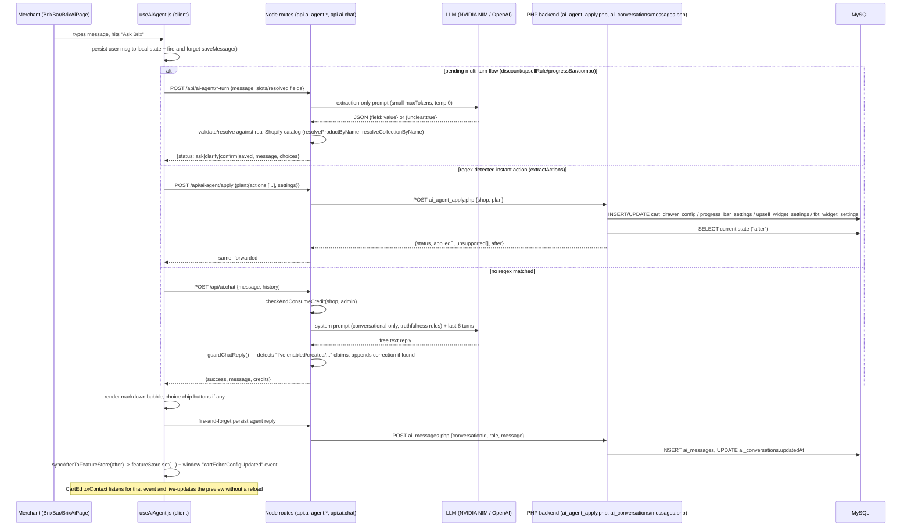

# 08 — The AI System ("Brix")

> Verified against source code in `c:\xampp\htdocs\cartdrawerv2_ui` on 2026-07-16.
> Scope note: `Brix_ref_ui/Brix_Upsell_V1/` is a separate reference/backup copy of this
> app checked into the repo (shows as modified in `git status`). It is **not** the live
> app and is excluded from everything below — all findings are from `app/` and
> `php_backend/` at the repo root.

## 1. Architecture

### CartNinja is confirmed gone

`CartNinjaAgentV2.jsx`, `CartNinjaFloatingLauncher`, and `app/routes/api.ai-agent.generate.jsx`
**do not exist** anywhere in `app/`. A repo-wide search for `CartNinja` only turns up matches in
stale markdown docs (`BRIX_OVERVIEW.md`, `USER_GUIDE.md`, `SETUP.md`, `CLAUDE.md`) — none in
actual code. There is exactly **one** AI UI system today: **Brix**, implemented as two
components sharing one hook.

### Current components (`app/components/ai-agent/`)

| File | Role |
|---|---|
| `useAiAgent.js` | The entire client-side brain — conversation state, regex-based intent detection, flow dispatch, credit tracking, localStorage cache. Both UI components call this one hook. |
| `BrixBar.jsx` | Compact pill-shaped bar that expands into a small floating or inline chat panel. Sizes `lg`/`md`/`sm`; can be `floating` (portaled to `document.body`, fixed-position) or inline. |
| `BrixAiPage.jsx` | Full-page chat UI (ChatGPT-style), mounted only at the dedicated `/app/brix-ai` route. |
| `api.js` | Thin fetch wrapper (`aiApi`) around `/api/ai/*` endpoints (conversations, messages, suggestions, tools, credits, chat). |
| `featureStore.js` | localStorage-backed cache of which widgets are on/off, used for optimistic UI sync after an action. |
| `MarkdownMessage.jsx` | Lazy-loaded `react-markdown` + `remark-gfm` renderer for agent replies. |

**`CLAUDE.md`'s description is stale.** It says BrixBar is scoped to "Combo builder pages
only" (`app.bundles.customize.jsx` / `app.bundles._index.jsx`). In the current code, `<BrixBar>`
is mounted on **9 distinct places**, spanning most of `/app/*`:

```
app/routes/app.fbt.jsx:809            <BrixBar size="md" floating />
app/routes/app.coupons.jsx:260        <BrixBar size="md" floating />
app/routes/app.bundles._index.jsx:229 <BrixBar size="md" floating />
app/components/CartEditorSidebar.jsx:201  <BrixBar size="sm" floating={false} />
app/routes/app.bundles.customize.jsx:2891 <BrixBar size="md" floating />   (template-picker gate)
app/routes/app.bundles.customize.jsx:3105 <BrixBar size="md" floating zIndex={400} .../>  (main builder)
app/routes/app.analytics.jsx:435      <BrixBar size="md" floating />
app/routes/app.additional.jsx:118     <BrixBar size="md" floating />
app/routes/app.productwidget.jsx:740  <BrixBar size="md" floating />
```

The two mounts inside `app.bundles.customize.jsx` are **not simultaneous** — one sits behind
an early `if (!pickedLayout && !initialTemplate) return (...)` template-picker gate, the other
in the main builder JSX reached only after that gate is satisfied. So the "duplicate BrixBar"
bug CLAUDE.md warns about does not currently reproduce, but the two render paths are easy to
break independently if either is edited without checking the other.

There is also a dedicated full-page route, `app/routes/app.brix-ai.jsx`, which renders
`BrixAiPage` and is linked from the app's main nav (`<s-link href="/app/brix-ai">Brix AI</s-link>`
in `app/routes/app.jsx`).

### Full request lifecycle

The critical architectural fact: **most "actions" never reach the LLM at all.** `useAiAgent.js`
runs the user's raw text through a cascade of **client-side regexes** first; only if none of
them match does it fall back to the free-form LLM chat endpoint (which itself is read-only,
see §2/§3). Order of the cascade in `sendMessage` (`app/components/ai-agent/useAiAgent.js`):

1. **Pending multi-turn flow in progress?** → forward the message to that flow's turn endpoint (`runFlowTurn`/`finalizeFlow`).
2. `looksLikeAutoUpsellIntent` → `/api/ai-agent/auto-upsell` (no LLM; pure data analysis).
3. `looksLikeAovQuery` → `/api/ai-agent/store-insights` (no LLM; templated from real DB/catalog data).
4. `looksLikeComboIntent` → starts the `combo` flow via `/api/ai-agent/combo-turn`.
5. `looksLikeProgressBarIntent` → starts the `progressBar` flow via `/api/ai-agent/progress-bar-turn`.
6. `looksLikeDiscountIntent` → starts the `discount` flow via `/api/ai-agent/discount-turn`.
7. `isRevenueQuery` → direct fetch of `/api/analytics/summary` (no LLM).
8. `extractActions(text)` (regex module/action matcher: cartDrawer, progressBar, upsells, fbt, trustBadges, styling.applyTemplate, styling.matchTheme, optimization.optimizeMobile) → `/api/ai-agent/apply` (or `/api/ai-agent/match-theme` for theme matching). If an `upsells.enable` action was detected, immediately follow up by starting the `upsellRule` flow too.
9. **Only if none of the above matched** → free-form chat via `/api/ai.chat` (real LLM call, conversational only, cannot execute anything).



## 2. What the AI can do — full capability inventory

### A. Deterministic, LLM-independent actions (via `applyActionsViaApi` → `/api/ai-agent/apply` → `php_backend/ai_agent_apply.php`)

`ai_agent_apply.php` is a `switch ($action)` over one flat action-name string. This is the
authoritative list of what actually writes to the DB:

| Action string | DB effect | Notes |
|---|---|---|
| `enableDrawer` / `disableDrawer` | `cart_drawer_config.is_enabled` + legacy `cart_drawer.cartStatus`; optional `position` (`left`/`right`) | |
| `enableGoalBar` / `disableGoalBar` | `progress_bar_settings.is_enabled`; optional `completion_text`, `placement` (`top`/`bottom`), and updates/creates the **first** `progress_bar_tiers` row (`min_value`, `reward_type`, `icon_preset`) | Only ever touches the single first/primary tier — multi-tier setup still requires the manual panel. |
| `enableUpsell` / `disableUpsell` | `upsell_widget_settings.is_enabled` | |
| `enableFBT` / `disableFBT` | `fbt_widget_settings.is_enabled`; optional `selected_template`, `mode` | |
| `applyTheme` | `cart_drawer_config.header_bg_color/header_text_color`, `.checkout_button_bg_color/checkout_button_text_color`, and read-modify-write of legacy `cart_drawer.checkout_button_style` JSON blob | Used by `matchTheme` after live theme detection. |

Anything else reaching this switch's `default:` branch (e.g. `enableTrustBadges`,
`disableTrustBadges`, `applyTemplate`, `matchTheme` itself as a raw action name,
`optimizeMobile`) is pushed to `$unsupported` and explicitly **not** marked as applied — the
PHP comment is explicit: *"Recognized by the client-side keyword matcher but with no real
backing DB column/handler here... Must NOT be added to $applied, or the caller will report
'Completed' for a no-op."* The client (`useAiAgent.js`'s `failureLine`) surfaces this honestly
as *"isn't available yet — there's no backend for that action."*

So of the client-recognized modules (`cartDrawer`, `progressBar`, `upsells`, `fbt`,
`trustBadges`, `styling.applyTemplate`, `styling.matchTheme`, `optimization.optimizeMobile`),
**trust badges, apply-theme-preset ("Premium Dark"/"Minimal Light"/"Luxury Gold"), and mobile
optimization are recognized by the client's regex layer but are dead ends server-side** — they
report as unsupported, not as done.

`/api/ai-agent/apply` requires an authenticated admin session and forwards to PHP with an
`X-Forge-Secret` header set to `SHOPIFY_API_KEY`; PHP checks that header against
`getenv('SHOPIFY_API_KEY')` and 403s otherwise.

### B. Match Store Theme (`/api/ai-agent/match-theme`)

Not a DB write directly — it detects the storefront's real theme colors two ways (in order):
1. Reads the live theme's `config/settings_data.json` via the Admin REST Theme Assets API and extracts hex/background/button/text colors by heuristic key matching (`background`/`bg`, `text`, `button`/`accent`/`primary`, `button_label`).
2. Falls back to fetching the storefront's live HTML, pulling `<link rel=stylesheet>` hrefs, and regex-scanning the CSS for `--custom-property: value;` declarations (hex or `r,g,b`).

If it finds nothing usable from either, it returns an honest failure and asks the merchant to
give explicit color codes instead. On success it POSTs an `applyTheme` action to
`ai_agent_apply.php` exactly like §A.

### C. Multi-turn "flow" actions (ask → confirm → execute, with real Shopify/DB validation)

Four flows, each with its own route, driven by one generalized client-side state machine
(`pendingAction` in `useAiAgent.js`). Confirmation is a real choice-chip UI (`✅ Confirm` /
`✖ Cancel`); a flow bails out to manual UI after **3 failed clarify attempts** (`BAIL_TEXT`).

1. **`upsellRule`** (`/api/ai-agent/upsell-rule-turn`) — "add upsell trigger X offer Y". Gated by `canPublishFeature(planKey, 'ai_cart_upsell')` (locked on Free plan preview tier). LLM call is extraction-only (`extractionSystemPrompt` asks for `{trigger, offer}` JSON). Products are resolved against the real Shopify catalog via `resolveProductByName` (GraphQL `products(query: "title:*name*")`); ambiguous matches (2+ hits) are shown as a pick-list, exact case-insensitive title match wins over ambiguity. On confirm, `appendUpsellRule` appends one `{id, triggerProductIds, upsellProductIds}` entry to `upsell_widget_settings.manual_rules` (JSON column) and sets `is_enabled=1`.
2. **`discount`** (`/api/ai-agent/discount-turn`) — "create a discount X, N% off". LLM extracts `{code, percentage, title, minimumAmount, endDate, usageLimit, onePerCustomer}`. If code+percentage are known but no title was given, it **auto-generates a default title** (`"${percentage}% Off Storewide"`) rather than leaving it blank — matches the "Coupon Name always required" fix noted in project memory. On confirm, calls the real Shopify Admin GraphQL `discountCodeBasicCreate` mutation (percent off, whole order, `combinesWith` all false, `appliesOncePerCustomer` from extraction), then persists a local cache copy via `/api/create_coupon-sample`.
3. **`progressBar`** (`/api/ai-agent/progress-bar-turn`) — a slot-filling wizard (`rewardType` → `goalAmount` → `placement`), each with closed-set choice chips. Direct value matching is tried before spending an LLM call; LLM extraction only runs for slots not resolved by chip/direct match. On finalize, POSTs `{actions:['enableGoalBar'], settings:{...}}` to `ai_agent_apply.php` via `sendToPhp` (Node-side helper), i.e. reuses §A's handler.
4. **`combo`** (`/api/ai-agent/combo-turn`) — bundle/combo creation. Slots: `layout` (maps chat phrasing to `layout1`/`layout2`/`layout4` — layout3 is explicitly excluded from AI creation as "too complex"), `collectionId` (resolved via `resolveCollectionByName` against the real Shopify catalog, with the same ambiguous-candidate pick-list pattern as products), `discountPercentage`, `templateName`. Gated by `checkComboPlanGate` (`canAccessFeature(planKey, 'build_a_combo')` — locked on Free; also enforces `comboTemplateLimit` per plan). On finalize, calls `createComboTemplate` which writes a **draft, inactive** (`status:'draft', is_active:0`) row to SQLite `combo_templates` — the merchant must open Build a Combo to review/publish it.

### D. Autonomous, no-question actions

- **`autoUpsellIntent`** (`/api/ai-agent/auto-upsell`) — phrases like "recommend the best upsell for me" / "optimize my cart" / "increase AOV" (as a command, not a question) skip all slot-filling. `getBestUpsellPair` (`app/services/upsell-recommendation.server.js`) does **real basket analysis**: queries `store_order_line_items`/`store_orders` for the most frequently co-purchased product pair over the last 2 years (`JOIN ... GROUP BY product_a, product_b ORDER BY co_count DESC`), falls back to a best-seller pair (`getTopProducts`) if no repeat co-purchases exist, and returns `{status:'insufficient-data'}` (never a fabricated pair) if the shop has fewer than 2 products with sales history. On success it writes via `appendUpsellRule` and then **re-reads the DB row to verify the write actually landed** (`verifyRuleSaved`) before reporting success — if verification fails it reports an honest error rather than claiming success.
- **`aovQuery`** (`/api/ai-agent/store-insights`) — read-only. Builds a report from `getStoreConfigSnapshot` (which widgets are on/off), `getPeriodTotals` (real month-to-date AOV/order count, gated by `canAccessFeature(planKey, 'full_analytics')`, requiring ≥3 orders), and falls back to `getCatalogSnapshot` (product count, price range, out-of-stock count, uncategorized count) when order data is unavailable or the plan is locked. Recommends up to 3 disabled revenue features with hardcoded industry-estimate lift ranges (e.g. "Enable AI Upsells — Estimated lift: 8-15%") as choice chips. **No LLM call is made for this route** — explicitly templated, not generated, "since no LLM call is made" per the code comment, specifically to avoid presenting a fabricated number as fact.
- **Revenue query** (`isRevenueQuery`, client-side only) — directly fetches `/api/analytics/summary` for month-to-date revenue/order-count/AOV; no LLM, no `/api/ai-agent/*` route at all.

### E. Free-form conversational chat (`/api/ai.chat` → `api.ai.chat.jsx`)

The only route that makes a genuinely open-ended LLM call. Explicitly and exclusively
**answer-only** — see §3/§7 for the hard boundary the system prompt enforces. It has **zero**
ability to trigger any action; it can only produce text.

### Full enumerated action-type list (quoted from code)

From `app/routes/api.ai.tools.jsx` (`TOOLS` constant, exposed via `/api/ai/tools` — this is a
catalog surfaced to the UI, not an LLM function-calling schema):
```
enableDrawer, disableDrawer, enableGoalBar, disableGoalBar,
enableUpsell, disableUpsell, enableFBT, disableFBT,
applyTemplate, matchTheme, optimizeMobile
```
Note `applyTemplate` and `optimizeMobile` are listed here as "tools" but are in PHP's
`$unsupported` bucket (§A) — the tools list overstates what's actually wired up.

From `app/components/ai-agent/useAiAgent.js`'s `MODULE_TO_ENGINE` (the client's actual
module→engine mapping used to build the `/api/ai-agent/apply` payload):
```js
cartDrawer:  { enable: 'enableDrawer',      disable: 'disableDrawer'     },
progressBar: { enable: 'enableGoalBar',     disable: 'disableGoalBar'    },
upsells:     { enable: 'enableUpsell',      disable: 'disableUpsell'     },
fbt:         { enable: 'enableFBT',         disable: 'disableFBT'        },
trustBadges: { enable: 'enableTrustBadges', disable: 'disableTrustBadges'},
```
`trustBadges` engines have no case in `ai_agent_apply.php` at all — confirmed unsupported.

## 3. What the AI explicitly cannot / should not do

### Free-form chat (`api.ai.chat.jsx`) — hard-coded system prompt boundary

Quoted directly from `SYSTEM_PROMPT` in `app/routes/api.ai.chat.jsx`:

> "But in this conversation you can only write a reply — you have no ability to change any
> setting or create anything here, and nothing you say is executed against the merchant's
> store... 1. Never say or imply you enabled, created, configured, updated, applied, fixed, or
> turned on/off anything — you did not and cannot... 2. Never promise future action ("I'll set
> this up", "I'll notify you", "I'll keep monitoring", "I'll follow up")... 3. Never state
> specific store data you were not given in this conversation — revenue, order counts,
> product/customer names, installed apps, or which features are currently on... 4. Never state a
> specific date, version, or "as of" fact you're not certain of, including your own knowledge
> cutoff or today's date."

This is backstopped by a **code-level guardrail**, not just prompt compliance
(`app/services/ai-safety.server.js`, `guardChatReply`):

```js
const COMPLETION_CLAIM_RE = /\bI(?:'ve| have)?\s+(enabled|disabled|turned (on|off)|created|added|configured|updated|applied|fixed|set up|removed|deleted)\b/i;
const FUTURE_PROMISE_RE = /\bI(?:'ll| will)\s+(notify|monitor|watch|keep (an eye|track)|follow up|check back|let you know)\b/i;
```
If the LLM's reply trips either regex, the guard appends: *"(Note: I can only answer questions
here — nothing was actually changed. To make this change, send the exact action as its own
message, e.g. "Enable Upsells", or use the relevant page in the app.)"* — this is the entire
contents of `ai-safety.server.js`; there is no other guardrail file. This is a **defense-in-depth
backstop specifically scoped to the free-form chat path** — it does not run on any of the
flow-turn or apply routes (those never claim completion except after a real, verified DB write).

### Plan gating (feature-level, from `app/services/plan-permissions.server.js` + `app/config/plans.js`)

| Feature key | Free | Starter | Pro | Enforced in |
|---|---|---|---|---|
| `ai_brix` (the chat itself) | enabled | enabled | enabled | Always available; credit-limited, not plan-locked. |
| `ai_cart_upsell` | preview (locked for AI writes) | enabled | enabled | `upsell-rule-turn.jsx` and `auto-upsell.jsx` both call `canPublishFeature(planKey, 'ai_cart_upsell')` and return `status:'locked'` with message `"Upsell rules need the Starter plan or above."` if not allowed. |
| `full_analytics` | locked | enabled | enabled | `store-insights.jsx` checks `canAccessFeature`; if locked, falls back to catalog-only insights instead of hard-failing. |
| `build_a_combo` | locked | enabled | enabled | `combo-turn.jsx`'s `finalize` branch calls `checkComboPlanGate`, which also enforces a numeric `comboTemplateLimit` per plan (counts existing `combo_templates` rows). |

### Other guardrails found in code

- **`X-Forge-Secret` header check** on every PHP AI endpoint (`ai_agent_apply.php`,
  `ai_conversations.php`, `ai_messages.php`) — compares the incoming header to
  `getenv('SHOPIFY_API_KEY')`; 403s the request if mismatched. This is Node→PHP service auth,
  not a merchant-facing permission model.
- **Shopify admin session required** on every `/api/ai*` and `/api/ai-agent/*` route via
  `authenticate.admin(request)` — an unauthenticated request never reaches the LLM or DB.
- **Verify-after-write pattern**: `auto-upsell.jsx` re-queries the DB after `appendUpsellRule`
  to confirm the new rule id actually exists before reporting success (`verifyRuleSaved`).
- **3-attempt clarify cap** on all four multi-turn flows (`useAiAgent.js`): `if ((pendingAction.attempts || 0) >= 3)` bails to a flow-specific `BAIL_TEXT` pointing the merchant to the manual UI, rather than looping forever on ambiguous input.
- **In-memory-only pending state**: `pendingAction` is explicitly never persisted to
  localStorage — code comment: *"a persisted pending clarification would otherwise survive a
  reload/navigation and could hijack a much later, completely unrelated message."*
- **Question vs. command disambiguation**: `looksLikeQuestion` (regex for interrogative
  starters + absence of command verbs) gates nearly every intent detector, so "is upsells
  enabled?" does not fire the same code path as "enable upsells."
- **No prompt-injection-specific defense found.** There is no sanitization of user input before
  it's placed in an LLM prompt beyond the extraction prompts being narrowly scoped (max tokens
  100-150, temperature 0, asked to reply with only JSON). `guardChatReply` only catches
  *completion claims*, not injected instructions attempting to change the system prompt's
  behavior. **Not Verified**: no dedicated prompt-injection test or filter exists in
  `ai-safety.server.js` or elsewhere in the AI route files reviewed.

## 4. Prompt handling

Two categories of LLM call exist; centralized through `app/services/ai-llm.server.js`.

### Provider/model resolution (confirmed exactly as CLAUDE.md describes, still current)

```js
function resolveProvider() {
  const apiKey = process.env.OPENAI_API_KEY || '';
  const isNvidia = apiKey.startsWith('nvapi-');
  return {
    apiKey,
    endpoint: isNvidia
      ? 'https://integrate.api.nvidia.com/v1/chat/completions'
      : 'https://api.openai.com/v1/chat/completions',
    model: isNvidia ? 'meta/llama-3.1-8b-instruct' : 'gpt-4o-mini',
  };
}
```
**Caveat**: `php_backend/ai_upsell.php`, the PHP file CLAUDE.md says has this same detection
patched in, **no longer exists** in `php_backend/` (only `ai_agent_apply.php`,
`ai_conversations.php`, `ai_messages.php` remain). All current AI LLM calls happen in Node
(`ai-llm.server.js`) — PHP `ai_*` files today are pure CRUD (conversations/messages) or pure DB
writers (apply), with no LLM calls in PHP at all.

### 1. Free-form chat (`api.ai.chat.jsx`)
- System prompt: fixed persona + the boundary rules from §3, ~600 words, defined as a
  hardcoded template literal (`SYSTEM_PROMPT`), not built from live store data.
- Context injected: last 6 turns of client-side `messages` history (`history.slice(-6)`),
  role-mapped (`agent`→`assistant`), plus the current user message. **No product catalog, no
  store config, no page-state injection** — the prompt explicitly tells the model it has "no
  live access to the store."
- `temperature: 0.7`, `max_tokens: 600`, with one bounded auto-continuation
  (`MAX_CONTINUATIONS = 1`) if `finish_reason === 'length'`, asking the model to "Continue
  exactly where you left off."

### 2. Extraction prompts (discount-turn, upsell-rule-turn, progress-bar-turn, combo-turn)
- Each route has its own narrow, single-purpose system prompt asking for **JSON only**, e.g.
  discount: *"Extract: code..., percentage..., title... Reply with ONLY JSON, no prose... If
  you cannot identify a code or a percentage at all, reply `{"unclear":true}`."*
- `temperature: 0`, small `max_tokens` (100-150), deterministic-leaning.
- `parseJsonReply` (`ai-llm.server.js`) strips \`\`\`json fences and falls back to
  `{unclear:true}` on any parse failure — malformed LLM output degrades to "ask again," never
  a crash or a silently-wrong action.
- These extraction calls receive **only the current message** as user content — no
  conversation history is passed to the extraction LLM. Multi-turn state (`slots`,
  `resolvedTrigger`, etc.) is carried by the client and round-tripped as explicit request
  fields, not by re-sending chat history to the model.

No page/DOM state, product catalog, or live store data is ever injected directly into an LLM
prompt in this codebase. Where store data matters (product/collection resolution, catalog
snapshot, revenue figures), it is fetched via direct Shopify GraphQL/DB queries **after** LLM
extraction, and validated against real records — the LLM only ever extracts free-text
intent/parameters, never asserts facts about the store.

## 5. Action execution & validation flow

Step by step, for a representative flow (`upsellRule`, `app/routes/api.ai-agent.upsell-rule-turn.jsx`):

1. Route requires `authenticate.admin(request)` — no session, no execution.
2. Plan gate: `canPublishFeature(planKey, 'ai_cart_upsell')` — returns `status:'locked'` if not allowed, before any credit is consumed or LLM called.
3. If `finalize` is not set: credit consumed (`checkAndConsumeCredit`), then LLM extraction call scoped to whichever side (`trigger`/`offer`/`both`) is still unresolved.
4. Each extracted product name is resolved against the **real** Shopify catalog via `resolveProductByName` (GraphQL `products(query:"title:*name*")`). Three outcomes: `found` (exact case-insensitive match wins, or single match), `ambiguous` (2+ matches → candidate list shown, not guessed), `not_found` (explicit "I couldn't find a product matching..." reply, not a silent skip).
5. Once both `trigger` and `offer` are resolved objects `{id, title}`, the route returns `status:'confirm'` with a plain-language summary and `✅ Confirm` / `✖ Cancel` choice chips — **nothing is written yet**.
6. Client sends the confirm/cancel back; on `__confirm__`, the route is called again with `finalize:true`. **Only at this point** does `appendUpsellRule` execute the DB write (`upsell_widget_settings.manual_rules` JSON array append + `is_enabled=1`).
7. Response returns `status:'saved'` with the real `trigger`/`offer` objects; the client renders a natural-language confirmation built from **that returned data**, not from a canned string (`savedMessage()` in `useAiAgent.js`, code comment: *"only ever shown after the corresponding turn route returns 'saved', i.e. after a real DB write succeeded... Never rephrase these to imply something happened before that write."*).

The instant-action path (§2A, `ai_agent_apply.php`) has no separate confirm step — it applies
immediately — but still validates by **reading back real DB state** into an `after` object after
every write, which the client uses to sync `featureStore` and dispatch a
`cartEditorConfigUpdated` DOM event (so `CartEditorContext` reflects the true state, not an
assumed one). Actions with no PHP `case` are explicitly excluded from `$applied` (§2A) rather
than defaulting to "success."

## 6. Fallback / error handling

- **LLM HTTP failure** (`ai-llm.server.js`'s `requestLlm`): non-OK response logs the status +
  truncated body to console and returns `{content: null, finishReason: null, errorStatus:
  res.status}`. Callers branch on `content == null`.
  - In `api.ai.chat.jsx`: returns a real HTTP-status-aware message, e.g. *"Brix's AI service
    returned an error (HTTP 503) — this is usually temporary, try again in a minute."* or a
    generic *"I couldn't reach the AI service just now — try again in a moment."* if no status
    was available. Still returns HTTP 200 with `success:true` so the chat UI shows this as a
    normal (if apologetic) agent message rather than a network error.
  - Flow-turn routes wrap extraction failures in `parseJsonReply`'s `{unclear:true}` fallback,
    which routes to a `status:'clarify'` "ask again" response rather than failing hard.
- **Malformed LLM JSON**: `parseJsonReply` strips markdown code fences and
  `JSON.parse`s; any parse exception returns the caller-supplied fallback (`{unclear:true}` by
  default). No action is ever taken on unparseable output.
- **Network/exception catch-alls**: every route action handler is wrapped in `try/catch`
  logging `console.error('[route-name]', e)` and returning `status:'error'` with a generic
  *"Something went wrong. Please try again."* — never leaks stack traces to the client.
  `api.ai.chat.jsx`'s outer catch still returns `Response.json({success:true, message: ...})`
  (200 status) so the UI never shows a raw fetch failure.
- **Client-side catch** (`useAiAgent.js`'s `sendMessage`): any thrown error (network failure,
  etc.) renders *"Sorry, something went wrong... Please try again — if it keeps failing, the
  backend may be unavailable right now."*
- **Rate limits**: **Not Verified from Source Code.** No explicit HTTP 429 handling, retry/backoff
  logic, or rate-limit-specific messaging was found in `ai-llm.server.js` or any AI route — a
  429 from NVIDIA NIM/OpenAI would be handled the same as any other non-OK response (generic
  "AI service returned an error" message), not specially detected or retried.
- **PHP-side errors**: `ai_agent_apply.php` returns 400 for missing `shop`/`plan.actions`, 403
  for a bad `X-Forge-Secret`, 405 for non-POST. No PHP-side try/catch around the PDO calls was
  found — a DB error would surface as a raw PHP error/500, not a structured JSON error (**Not
  Verified** whether `config.php` sets a global exception handler upstream of these files).

## 7. Hallucination prevention

Two concrete, code-level mechanisms exist (this is the "truthfulness redesign" referenced in
project memory, and it is real, current code — not just planned):

1. **`guardChatReply`** (§3) — regex-scans every free-form chat reply for completion claims
   ("I've enabled...") or future promises ("I'll notify you...") and appends a corrective note
   if found. This is a **post-hoc string-matching backstop**, not a semantic check — it can miss
   paraphrased claims that don't match the fixed regex, and can false-positive on unrelated uses
   of those verbs (**Not Verified**: no test suite for this regex's false-positive/negative rate
   was found in `tests/`).
2. **Evidence-gated success messages** — client-side `pickEvidenceTimestamp` (`useAiAgent.js`)
   only surfaces a timestamp in the "evidence" object if the backend's `after` payload actually
   contained one (`updatedAt` from a real DB row); it is explicitly never fabricated. Comment:
   *"Real evidence only — shop domain from the authenticated session, timestamp only if the
   backend actually returned one. Never shown if neither is available (no fabricated
   evidence)."*
3. **Store-insights is deliberately non-generative** (§2D) — the AOV/revenue report route makes
   **zero LLM calls**; every line is templated from a live DB/GraphQL query result, specifically
   to avoid presenting a fabricated number as fact (explicit code comment).
4. **Verify-after-write** (§2D, §5) — `auto-upsell.jsx` re-reads the DB after writing a rule and
   only reports `status:'saved'` if the write is independently confirmed present.
5. **Product/collection resolution never guesses** — `resolveProductByName` and
   `resolveCollectionByName` return `not_found`/`ambiguous` states rather than picking a
   plausible-sounding match; the merchant is always asked to disambiguate rather than the system
   assuming.

There is **no cross-check of LLM claims against a second data source** (e.g. no "ask the model,
then verify its factual claim against the DB before showing it") beyond the mechanisms above —
the truthfulness strategy here is "never let the LLM state facts it wasn't given" (system-prompt
+ regex backstop) plus "never let a templated success message get ahead of a confirmed DB
write," not fact-checking generated prose against ground truth after the fact.

## 8. Credit / billing model for AI usage

Confirmed **exactly** matching the hypothesis in project memory — read directly from
`app/config/plans.js` and `app/services/ai-credits.server.js`:

| Plan | Monthly AI BRIX credit cap (`aiBrixCredits`) | Overage rate per credit past cap (`aiBrixOverageRate`) |
|---|---|---|
| Free | 10 | $0.01 |
| Starter | 30 | $0.03 |
| Pro | 90 | $0.09 |

Mechanics (`ai-credits.server.js`):
- One credit = one call to `checkAndConsumeCredit(shop, admin)`, called by essentially every AI
  route that either calls the LLM or executes a flow turn (chat, discount-turn, upsell-rule-turn,
  progress-bar-turn, combo-turn, auto-upsell — **but not** the purely-templated `store-insights`
  route, and not the instant-apply `/api/ai-agent/apply` / `/api/ai-agent/match-theme` routes,
  which consume no credit at all since they make no LLM call).
- Usage tracked per `(shop_domain, period_key)` in MySQL table `ai_brix_credit_usage`
  (`period_key` = `YYYY-MM`, UTC), via `INSERT ... ON DUPLICATE KEY UPDATE credits_used =
  credits_used + 1`.
- **Chat/actions are never blocked** once the cap is hit — code comment: *"Chat is never
  blocked: past the cap, the shop simply pays per extra credit at its plan's overage rate."*
  `checkAndConsumeCredit` always returns `allowed: true`.
- Once `credits_used > limit`, each additional credit calls `chargeAiCreditOverage`
  (`app/services/billing.server.js`), which records a row in `ai_brix_overage_charges`
  (`shop_domain, period_key, credit_number, plan_key, overage_rate, charge_amount, status`) and
  calls `createUsageCharge(admin, {amount, description, termsIncludes})` — a **real Shopify usage
  billing charge**, not a simulated one. Idempotency: if a charge for that exact
  `(shop, period, credit_number)` already has `status='charged'`, it's skipped
  (`{skipped:true, reason:'already charged'}`).
- The UI (`BrixBar`/`BrixAiPage` header pill) shows `${remaining}/${limit} credits` normally,
  switching to `Overage $X.XX/credit` styling once `isOverage` is true (fetched via
  `getCreditStatus`, a read-only, non-consuming status check used by `/api/ai/credits`).

## 9. Conversation history persistence

Persisted entirely through the **PHP backend on MySQL** (not Prisma/SQLite — despite
`ai-agent-history.server.js` being referenced in old project memory notes and a Prisma migration
file `prisma/migrations/20260618000002_create_ai_agent_history/migration.sql`, **no such service
file exists today** in `app/services/`; a repo-wide search found only stale references in docs,
`.gitignore`, and a one-off migration script `scripts/migrate-ai-history.cjs`, implying history
storage was migrated off Prisma onto the PHP/MySQL path at some point). Current tables, per
`php_backend/ai_conversations.php` / `ai_messages.php`:

- **`ai_conversations`**: `id` (PHP `uniqid()`), `shopDomain`, `title`, `createdAt`, `updatedAt`.
  Listed via `GET` (`ORDER BY updatedAt DESC LIMIT 50`, filtered by `shopDomain`). Created via
  `POST` with an auto-titled or client-supplied `title` (client generates a title from the first
  message via `generateTitle()` in `useAiAgent.js`, e.g. stripping filler words, capitalizing,
  truncating to 60 chars, capped acronyms like AOV/FBT/CSS).
- **`ai_messages`**: `id` (`uniqid()`), `conversationId`, `role` (`user`/`assistant`), `message`
  (plain text), `createdAt`. `POST` also bumps the parent conversation's `updatedAt`. Fetched via
  `GET ?conversationId=...` ordered `createdAt ASC`.

Both Node routes (`api.ai.conversations.jsx`, `api.ai.messages.jsx`) are thin authenticated
proxies to these PHP endpoints, using the same `X-Forge-Secret` auth as the apply route.
Persistence is explicitly **fire-and-forget** from the client (`useAiAgent.js`'s `persist()`
helper: `.catch(() => {})`) — failures never block the chat UI, since `messages` React state plus
a `localStorage` mirror (`brixbar_convs` / `brixbar_msgs` keys) are the actual source of truth
for the current session. The MySQL copy exists specifically so history "survives
reloads/devices," per the code comment, not as the live UI's primary store.

No conversation/message content is ever sent back into an LLM prompt except the last 6 turns for
the free-form chat route (§4) — flow-turn extraction prompts never see conversation history.

## Capabilities vs Limitations Summary Table

| Capability | Implemented? | Guardrails | Source file |
|---|---|---|---|
| Enable/disable Cart Drawer (+ position) | Yes | Instant apply, no confirm step; state read back and synced | `php_backend/ai_agent_apply.php` |
| Enable/disable Progress Bar (goal amount, reward type, placement) | Yes | Instant toggle when disabling; full slot-filling wizard + confirm when enabling with details | `api.ai-agent.progress-bar-turn.jsx`, `ai_agent_apply.php` |
| Enable/disable Upsell widget | Yes | Instant toggle; enabling immediately chains into the upsellRule flow to ask for trigger/offer | `ai_agent_apply.php`, `useAiAgent.js` |
| Enable/disable FBT (+ template, mode) | Yes | Instant apply | `ai_agent_apply.php` |
| Add an upsell rule (trigger→offer) | Yes | Plan-gated (`ai_cart_upsell`), real catalog product resolution, ambiguity disambiguation, explicit confirm step | `api.ai-agent.upsell-rule-turn.jsx` |
| Auto-generate best upsell rule from sales data | Yes | Real basket co-purchase analysis; `insufficient-data` honest failure; post-write DB verification | `api.ai-agent.auto-upsell.jsx`, `upsell-recommendation.server.js` |
| Create a discount code | Yes | LLM extraction + confirm step; real `discountCodeBasicCreate` GraphQL mutation; auto-fills a default title rather than leaving it blank | `api.ai-agent.discount-turn.jsx` |
| Create a bundle/combo page | Yes | Plan-gated (`build_a_combo`) + template-count-gated; real collection resolution; confirm step; saved as draft/inactive | `api.ai-agent.combo-turn.jsx`, `combo-templates.server.js` |
| Match cart drawer colors to live theme | Yes | Two-tier real detection (theme settings API, then live CSS scrape); honest failure message if neither works | `api.ai-agent.match-theme.jsx` |
| Apply a preset theme (Premium Dark/Minimal Light/Luxury Gold) | Recognized by client regex, **not implemented server-side** | Falls into PHP's `default:` branch → reported as unsupported, never as done | `useAiAgent.js` (`extractActions`), `ai_agent_apply.php` |
| Enable/disable Trust Badges | Recognized by client regex, **not implemented server-side** | Same as above — explicit `$unsupported` | `useAiAgent.js`, `ai_agent_apply.php` |
| Optimize for Mobile | Listed in `/api/ai/tools`, **not implemented server-side** | Reported as unsupported | `api.ai.tools.jsx`, `ai_agent_apply.php` |
| Store insights / AOV recommendations | Yes | Zero LLM calls — templated from real DB/catalog data only; plan-gated fallback to catalog-only | `api.ai-agent.store-insights.jsx` |
| Revenue/AOV lookup ("how much did we make") | Yes | Direct fetch of real analytics endpoint, no LLM | `useAiAgent.js` (`fetchRevenueSummary`) |
| Free-form Q&A chat | Yes | Cannot execute anything; hard system-prompt boundary + regex-based completion-claim guard | `api.ai.chat.jsx`, `ai-safety.server.js` |
| Conversation history persistence | Yes | MySQL via PHP, fire-and-forget from client, localStorage mirror as primary session store | `ai_conversations.php`, `ai_messages.php` |
| AI credit tracking + overage billing | Yes | 10/30/90 monthly caps by plan; $0.01/$0.03/$0.09 overage via real Shopify usage billing; never blocks usage | `ai-credits.server.js`, `billing.server.js`, `config/plans.js` |
| Prompt-injection defense | **Not Verified from Source Code** | No dedicated filter found beyond narrow-scope extraction prompts | — |
| Rate-limit-specific handling | **Not Verified from Source Code** | Treated as generic LLM API error | `ai-llm.server.js` |
